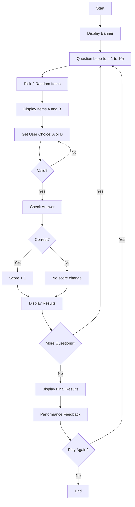

# Higher Lower Game - Function Call Flow & Flow Diagram

## Simple Version Call Flow

```
Script Start
  └─> print() welcome
  └─> for q in range(1, 11):
  │     └─> random.sample(DATA, 2) → a, b
  │     └─> print() item A and B names
  │     └─> input().upper() → guess
  │     └─> Compare followers
  │     └─> print() actual counts, correct/wrong, score
  └─> print() final score and percentage
Script End
```

## Production Version Call Flow

### Function Call Graph

```
run()
  ├─> print() welcome banner
  │
  └─> [Main Loop]
        ├─> play_round()
        │     └─> for q in range(1, TOTAL_QUESTIONS + 1):
        │           ├─> get_two_items()
        │           │     └─> random.sample(DATA, 2)
        │           ├─> print() items with categories
        │           ├─> get_user_choice()
        │           │     └─> input().strip().upper()
        │           │     └─> validate in ("A", "B")
        │           ├─> check_answer(choice, item_a, item_b)
        │           │     └─> Compare followers based on choice
        │           └─> print() results, update score
        │
        ├─> display_final_results(score)
        │     ├─> Calculate percentage
        │     ├─> get_performance_feedback(score, total)
        │     │     └─> Tier lookup based on percentage
        │     └─> print() score, percentage, feedback
        │
        └─> input() play again?
```

## Mermaid Flow Diagram


