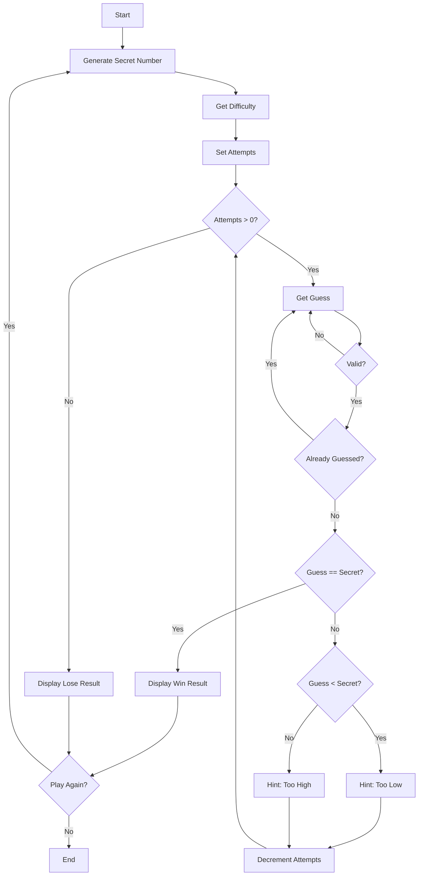

# Number Guessing Game - Function Call Flow & Flow Diagram

## Simple Version Call Flow

```
Script Start
  └─> print() welcome
  └─> random.randint(1, 100) → secret
  └─> input().lower() → difficulty
  └─> Set attempts (10 or 5)
  └─> while attempts > 0:
  │     └─> print() attempts remaining
  │     └─> input() → int() → guess
  │     └─> if guess == secret → win, break
  │     └─> elif guess < secret → "Too low"
  │     └─> else → "Too high"
  │     └─> attempts -= 1
  │     └─> if attempts == 0 → lose
Script End
```

## Production Version Call Flow

### Function Call Graph

```
run()
  ├─> print() welcome banner
  │
  └─> [Main Loop]
        ├─> play_game()
        │     ├─> random.randint(RANGE_MIN, RANGE_MAX) → secret
        │     ├─> get_difficulty()
        │     │     └─> input().strip().lower()
        │     │     └─> DIFFICULTY_MAP[raw] → attempts
        │     │
        │     └─> [While attempts > 0]
        │           ├─> get_guess(guessed)
        │           │     └─> input() → int()
        │           │     └─> Validate range and duplicates
        │           ├─> guessed.add(guess)
        │           ├─> history.append(guess)
        │           └─> Compare: ==, <, >
        │                 ├─> correct → return (True, secret, history)
        │                 └─> hint + attempts -= 1
        │
        ├─> display_result(won, secret, history)
        │     ├─> Print win/lose message
        │     ├─> Print guess count and history
        │     └─> min(history, key=lambda ...) → closest guess
        │
        └─> input() play again?
```

## Mermaid Flow Diagram


