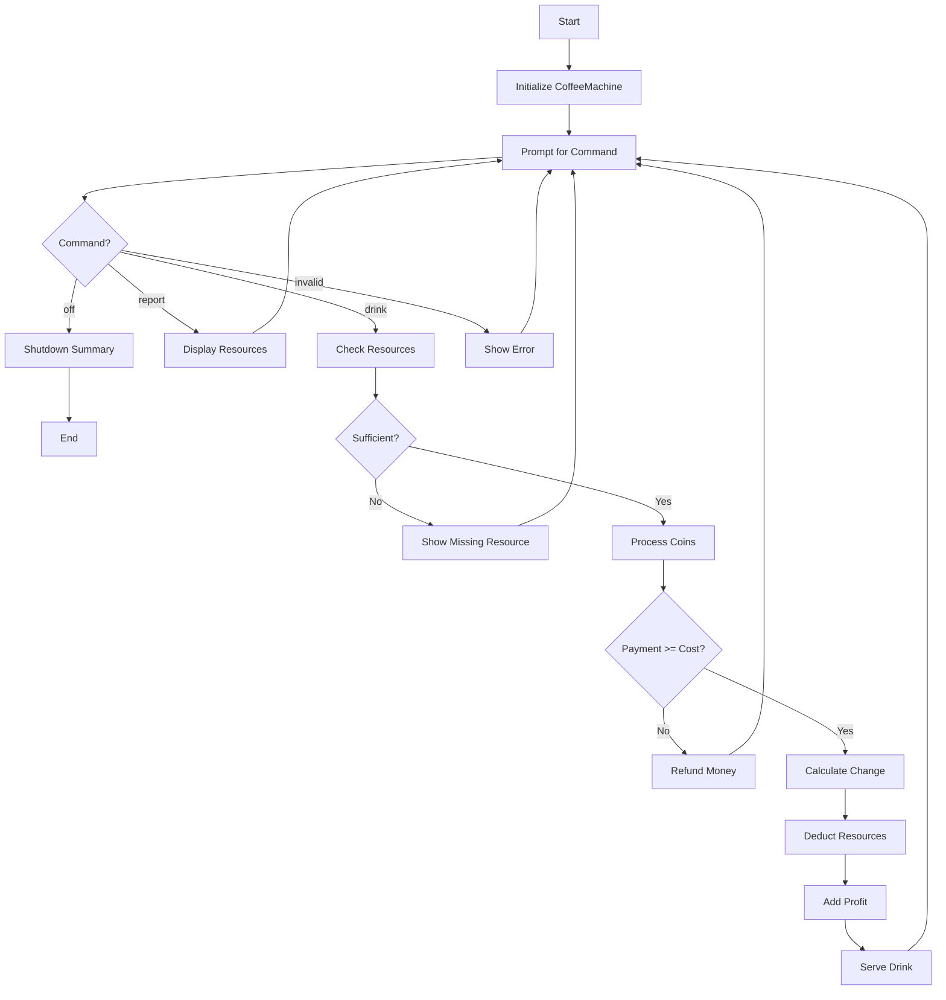
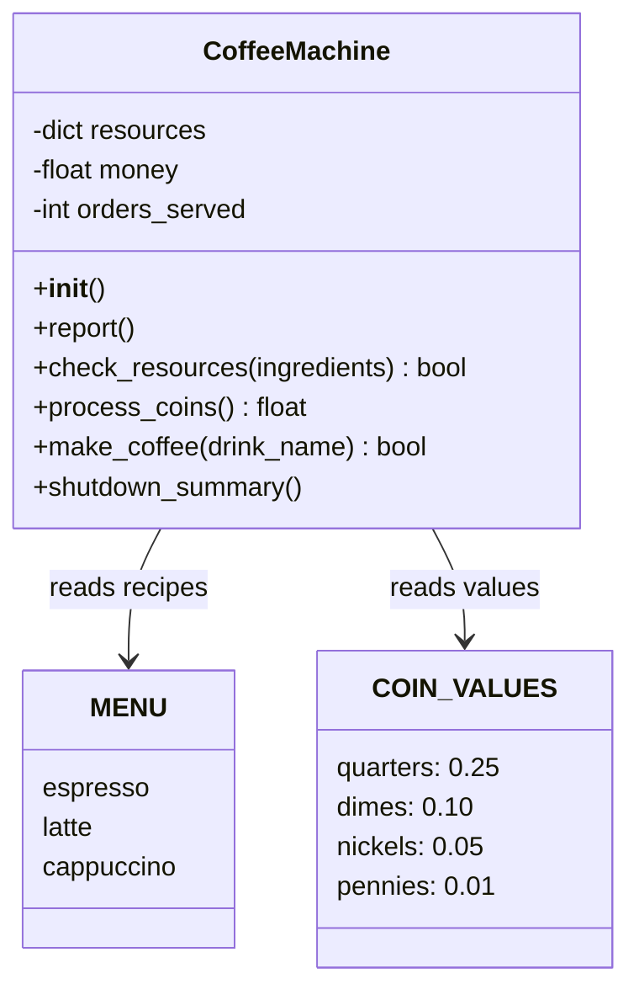

# Coffee Machine - Function Call Flow & Flow Diagram

## Simple Version Call Flow

```
Script Start
  └─> while is_on:
        └─> input() → choice
        ├─> "off" → is_on = False
        ├─> "report" → print resources
        ├─> drink name:
        │     ├─> is_resource_sufficient(ingredients)
        │     │     └─> Check each ingredient vs resources
        │     ├─> process_coins()
        │     │     └─> input() × 4 → calculate total
        │     ├─> Check payment >= cost
        │     │     └─> Calculate and return change
        │     └─> make_coffee(name, ingredients, cost)
        │           └─> Deduct resources, add profit
        └─> else → "Invalid choice"
Script End
```

## Production Version Call Flow

### Function Call Graph

```
run()
  ├─> CoffeeMachine()
  │     └─> __init__: resources, money, orders_served
  │
  └─> [Main Loop]
        └─> input() → choice
        ├─> "off" → machine.shutdown_summary()
        │              └─> print() stats and remaining resources
        │
        ├─> "report" → machine.report()
        │                └─> print() all resources and money
        │
        ├─> drink → machine.make_coffee(drink_name)
        │     ├─> machine.check_resources(ingredients)
        │     │     └─> for item, amount in ingredients.items()
        │     │     └─> Compare with self.resources
        │     │
        │     ├─> machine.process_coins()
        │     │     └─> for coin_name, value in COIN_VALUES.items()
        │     │           └─> input() → int() → validate >= 0
        │     │     └─> round(total, 2)
        │     │
        │     ├─> Check payment >= cost
        │     ├─> Deduct ingredients from self.resources
        │     ├─> self.money += cost
        │     └─> self.orders_served += 1
        │
        └─> else → "Unknown command"
```

## Mermaid Flow Diagram



## Class Structure


