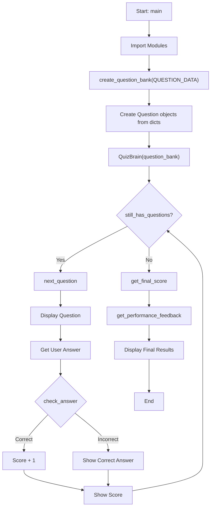
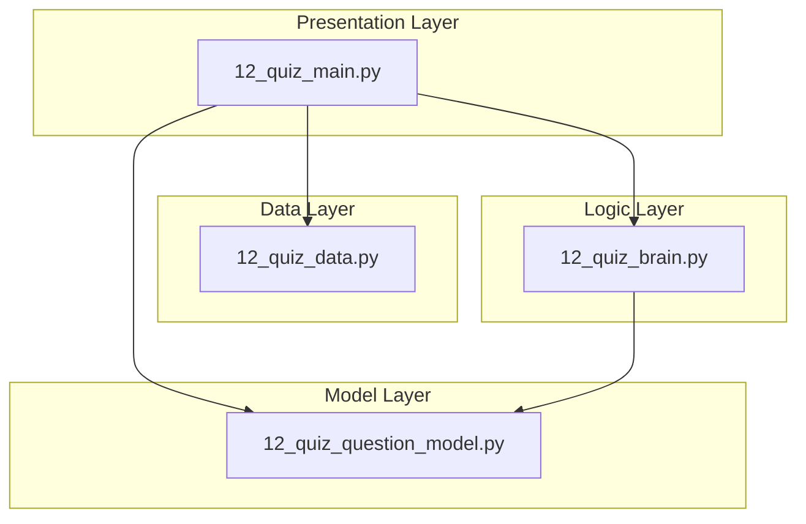
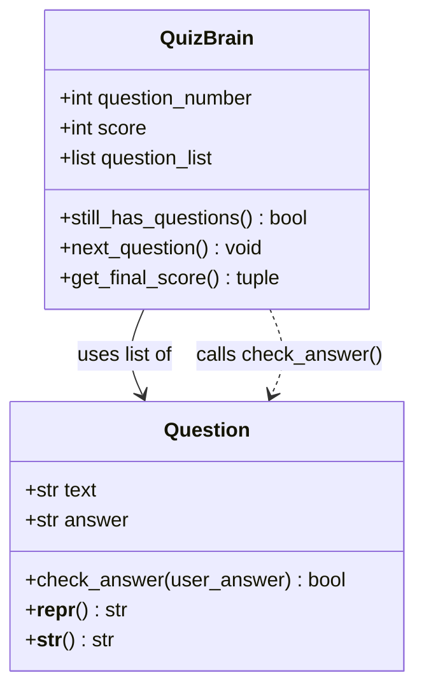

# Quiz Game - Function Call Flow & Flow Diagram

## Simple Version Call Flow

```
Script Start
  └─> print() welcome
  └─> for i, q in enumerate(QUESTION_DATA, 1):
  │     └─> print() question number and text
  │     └─> input() → user_answer
  │     └─> Compare .lower() of user vs correct
  │     └─> Update score, print feedback
  └─> print() final score and percentage
Script End
```

## Production Version Call Flow

### Entry Point
```
__main__ guard in 12_quiz_main.py
  └─> main()
```

### Module Import Chain
```
12_quiz_main.py
  ├─> from quiz_data import QUESTION_DATA
  ├─> from quiz_question_model import Question
  └─> from quiz_brain import QuizBrain
```

### Function Call Graph

```
main()
  ├─> print() welcome banner
  │
  ├─> create_question_bank(QUESTION_DATA)
  │     └─> for item in data:
  │           └─> Question(item["question"], item["answer"])
  │                 └─> __init__: self.text, self.answer
  │     └─> return list of Question objects
  │
  ├─> QuizBrain(question_bank)
  │     └─> __init__: question_number=0, score=0, question_list
  │
  ├─> while quiz.still_has_questions():
  │     │   └─> self.question_number < len(self.question_list)
  │     │
  │     └─> quiz.next_question()
  │           ├─> Get current Question from list
  │           ├─> Increment question_number
  │           ├─> print() question text
  │           ├─> input() → user_answer
  │           └─> current.check_answer(user_answer)
  │                 └─> strip().lower() comparison
  │
  ├─> quiz.get_final_score()
  │     └─> return (score, total, percentage)
  │
  └─> get_performance_feedback(percentage)
        └─> Tier lookup → feedback string
```

## Mermaid Flow Diagram



## Module Dependency Diagram



## Class Interaction Diagram


