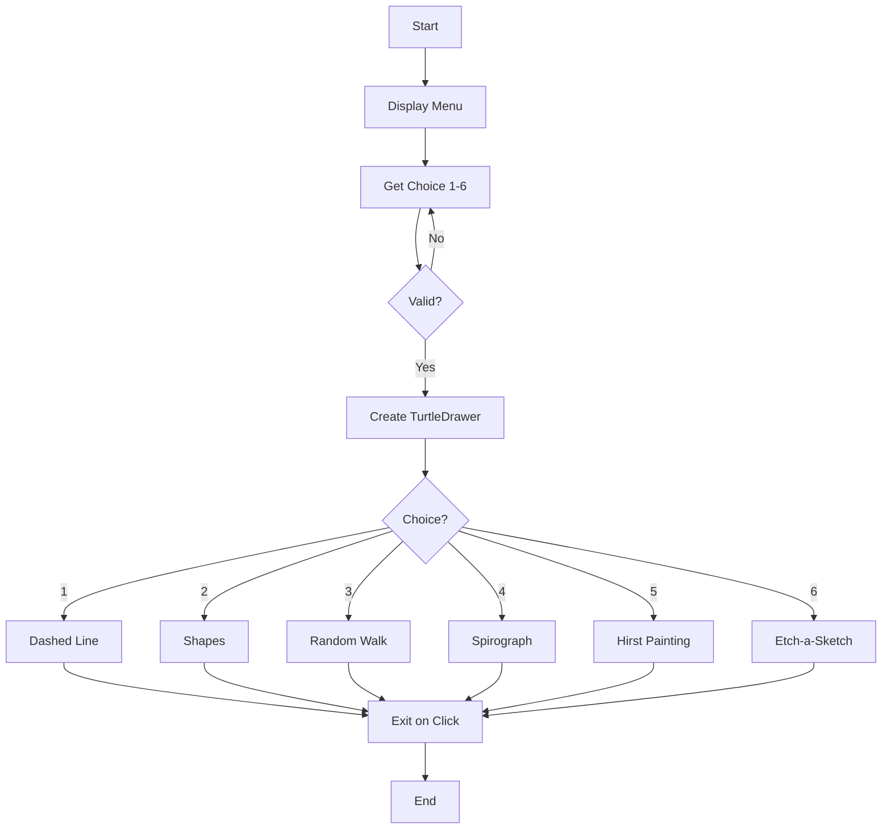
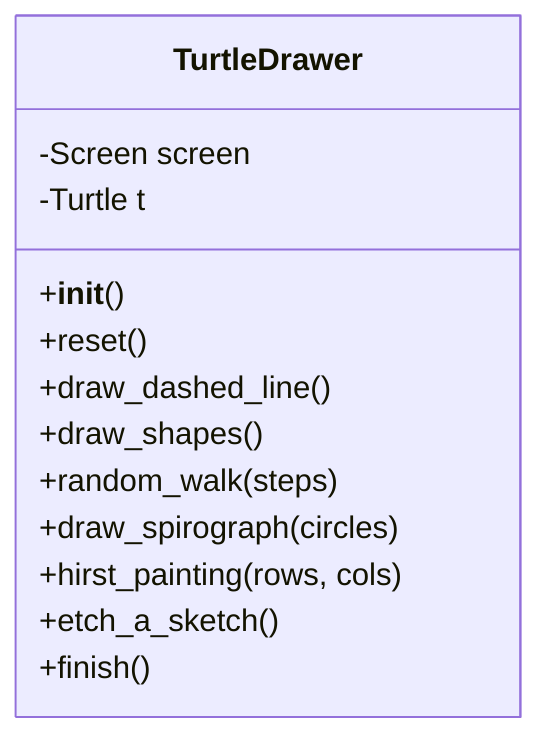

# Turtle Drawing - Function Call Flow & Flow Diagram

## Simple Version Call Flow

```
Script Start
  └─> print() menu
  └─> input() → choice
  └─> turtle.Screen(), screen.colormode(255)
  └─> if/elif chain:
        ├─> draw_dashed_line() → t.forward/penup/pendown loop
        ├─> draw_shapes() → nested loop: sides × angles
        ├─> random_walk() → random direction/color loop
        ├─> draw_spirograph() → circle + left rotation loop
        ├─> hirst_painting() → nested row/col dot loop
        └─> etch_a_sketch() → screen.onkey() bindings
  └─> screen.exitonclick()
Script End
```

## Production Version Call Flow

### Function Call Graph

```
run()
  ├─> get_menu_choice()
  │     └─> print() menu
  │     └─> input() → int() → validate 1-6
  │
  ├─> TurtleDrawer()
  │     └─> __init__: screen.setup(), turtle.Turtle()
  │
  ├─> actions[choice]()  ← dict dispatch
  │     ├─> [1] drawer.draw_dashed_line()
  │     │     └─> reset() → forward/penup/pendown loop
  │     ├─> [2] drawer.draw_shapes()
  │     │     └─> reset() → nested polygon loop
  │     ├─> [3] drawer.random_walk(steps=200)
  │     │     └─> reset() → random.choice for color/direction
  │     ├─> [4] drawer.draw_spirograph(circles=72)
  │     │     └─> reset() → circle + left rotation loop
  │     ├─> [5] drawer.hirst_painting(rows=10, cols=10)
  │     │     └─> reset() → nested goto + dot loop
  │     └─> [6] drawer.etch_a_sketch()
  │           └─> reset() → screen.listen() → screen.onkey() × 5
  │
  └─> drawer.finish()
        └─> screen.exitonclick()
```

## Mermaid Flow Diagram



## Class Structure


