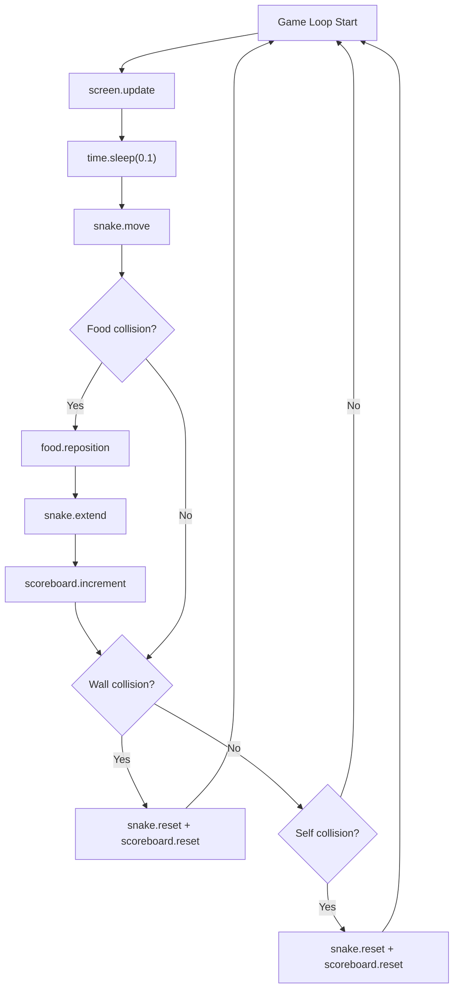
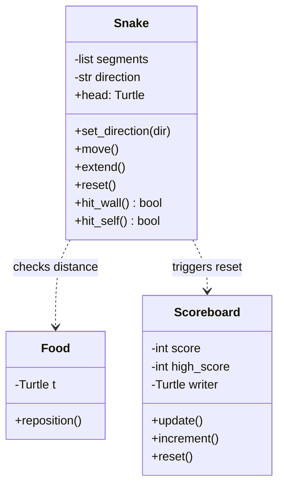

# Snake Game - Function Call Flow & Flow Diagram

## Game Loop Flow (Both Versions)

```
[Game Loop - runs every 0.1s]
  └─> screen.update()
  └─> time.sleep(GAME_SPEED)
  └─> snake.move()
  │     ├─> Shift body segments (tail → head)
  │     └─> Move head in current direction
  └─> Check food collision
  │     └─> food.reposition(), snake.extend(), scoreboard.increment()
  └─> Check wall collision
  │     └─> snake.reset(), scoreboard.reset()
  └─> Check self collision
        └─> snake.reset(), scoreboard.reset()
```

## Production Version Call Graph

```
run()
  ├─> Screen setup (title, bgcolor, size, tracer)
  │
  ├─> Snake()
  │     └─> __init__: segments=[], direction="stop"
  │     └─> _create_head(): Turtle(square, white)
  │
  ├─> Food()
  │     └─> __init__: Turtle(circle, red)
  │     └─> reposition(): random grid-snapped coords
  │
  ├─> Scoreboard()
  │     └─> __init__: score=0, high_score=0, writer Turtle
  │     └─> update(): write score text
  │
  ├─> screen.listen()
  ├─> screen.onkey(lambda, key) × 8
  │
  └─> [Game Loop]
        ├─> snake.move()
        │     ├─> for i in reverse: segments[i].goto(segments[i-1].pos)
        │     └─> head.setx/sety += DIRECTIONS[direction]
        │
        ├─> if head.distance(food) < 15:
        │     ├─> food.reposition()
        │     ├─> snake.extend() → new Turtle(square, grey)
        │     └─> scoreboard.increment() → score++, update display
        │
        ├─> if snake.hit_wall():
        │     └─> snake.reset() + scoreboard.reset()
        │
        └─> if snake.hit_self():
              └─> snake.reset() + scoreboard.reset()
```

## Mermaid Game Loop



## Class Diagram


