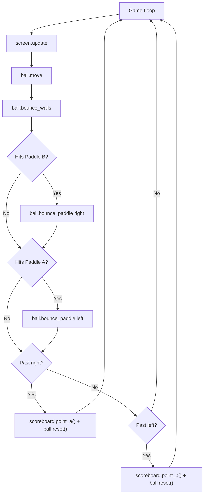
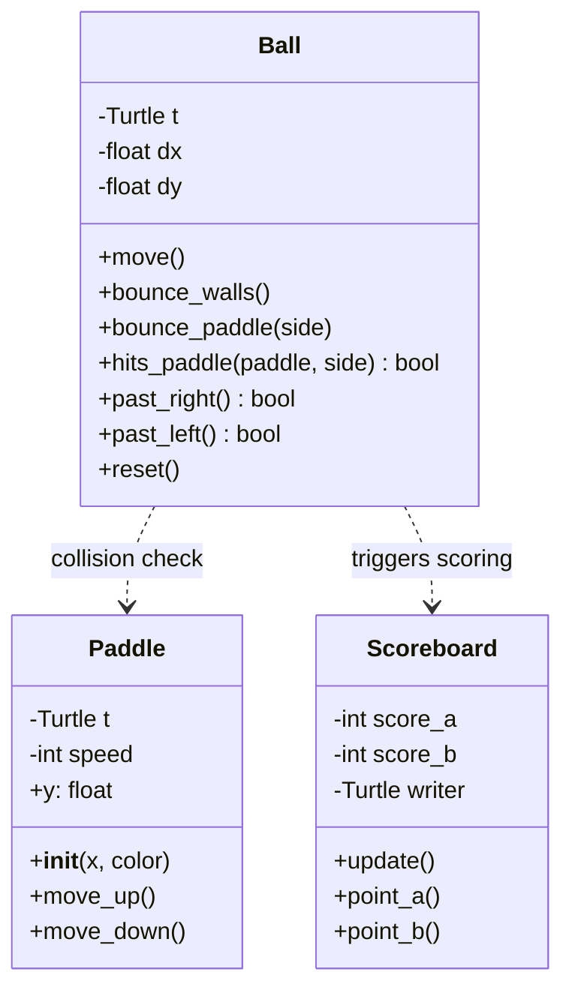

# Pong Game - Function Call Flow & Flow Diagram

## Production Version Call Graph

```
run()
  ├─> Screen setup (title, bgcolor, size, tracer)
  │
  ├─> Paddle(-PADDLE_X)    → Player A (left)
  ├─> Paddle(PADDLE_X)     → Player B (right)
  │     └─> __init__: Turtle(square, white, stretched), goto(x, 0)
  │
  ├─> Ball()
  │     └─> __init__: Turtle(square, white), dx/dy = INITIAL_SPEED
  │
  ├─> Scoreboard()
  │     └─> __init__: score_a=0, score_b=0, writer Turtle, update()
  │
  ├─> draw_center_line(screen)
  │     └─> Turtle → dashed line from top to bottom
  │
  ├─> screen.listen()
  ├─> screen.onkey() × 4 (w, s, Up, Down)
  │
  └─> [Game Loop]
        ├─> screen.update()
        ├─> time.sleep(0.005)
        │
        ├─> ball.move()
        │     └─> setx(xcor + dx), sety(ycor + dy)
        │
        ├─> ball.bounce_walls()
        │     └─> if |ycor| > BOUNDARY_Y → dy *= -1
        │
        ├─> ball.hits_paddle(paddle_b, "right")?
        │     └─> ball.bounce_paddle("right")
        │           ├─> dx *= -1
        │           ├─> speed increase (if < MAX)
        │           └─> setx(COLLISION_X)
        │
        ├─> ball.hits_paddle(paddle_a, "left")?
        │     └─> ball.bounce_paddle("left")
        │
        ├─> ball.past_right()?
        │     └─> scoreboard.point_a() + ball.reset()
        │
        └─> ball.past_left()?
              └─> scoreboard.point_b() + ball.reset()
```

## Mermaid Game Loop



## Class Diagram


