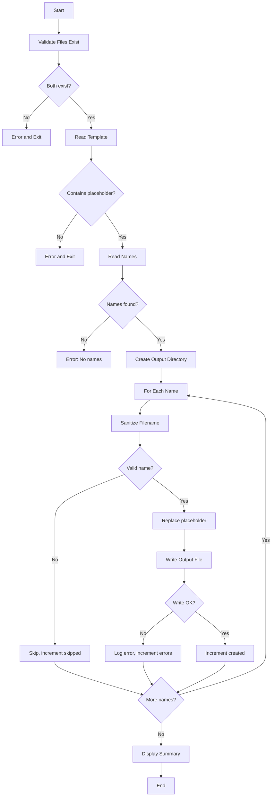
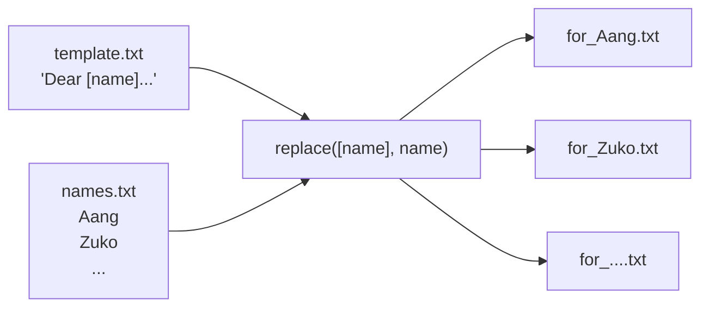

# Mail Merge - Function Call Flow & Flow Diagram

## Simple Version Call Flow

```
Script Start
  └─> os.makedirs(OUTPUT_DIR, exist_ok=True)
  └─> open(TEMPLATE_PATH) → template string
  └─> open(NAMES_PATH) → names list
  └─> for each name:
  │     └─> name.strip()
  │     └─> template.replace("[name]", name)
  │     └─> open(output_path, "w") → write letter
  │     └─> print() progress
  └─> print() summary count
Script End
```

## Production Version Call Graph

```
run()
  ├─> print() welcome banner
  │
  ├─> validate_files()
  │     ├─> TEMPLATE_PATH.exists()
  │     └─> NAMES_PATH.exists()
  │
  ├─> read_template()
  │     ├─> TEMPLATE_PATH.read_text(encoding="utf-8")
  │     └─> Check PLACEHOLDER in text
  │
  ├─> read_names()
  │     ├─> NAMES_PATH.read_text(encoding="utf-8")
  │     └─> splitlines() → strip() → filter empty
  │
  ├─> generate_letters(template, names)
  │     ├─> OUTPUT_DIR.mkdir(parents=True, exist_ok=True)
  │     └─> for each name:
  │           ├─> sanitize_filename(name)
  │           │     └─> re.sub(r"[^\w\s-]", "", name)
  │           ├─> template.replace(PLACEHOLDER, name)
  │           └─> output_path.write_text(letter)
  │                 └─> try/except OSError
  │
  └─> print() summary stats
```

## Mermaid Flow Diagram



## Data Flow


