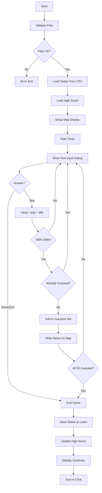

# US States Game - Function Call Flow & Flow Diagram

## Simple Version Call Flow

```
Script Start
  └─> turtle.Screen() + addshape() + shape()
  └─> open(CSV) → csv.DictReader → states dict
  └─> while len(guessed) < 50:
  │     └─> screen.textinput() → answer
  │     └─> if "Exit" → break
  │     └─> if valid state and not guessed → write on map
  └─> Save missing states to CSV
  └─> print() final score
  └─> screen.exitonclick()
Script End
```

## Production Version Call Graph

```
run()
  ├─> Validate CSV_PATH and IMAGE_PATH exist
  │
  ├─> load_states()
  │     └─> csv.DictReader → {name: (x, y)} dict
  │
  ├─> load_high_score()
  │     └─> HIGH_SCORE_PATH.read_text() → int
  │
  ├─> turtle.Screen() setup + addshape + shape
  │
  ├─> time.time() → start_time
  │
  ├─> [Game Loop: while guessed < total]
  │     ├─> screen.textinput() → answer
  │     ├─> if None or "exit" → break
  │     ├─> answer.strip().title() → cleaned
  │     └─> if valid and not guessed:
  │           ├─> guessed.add(cleaned)
  │           └─> write_state_on_map(name, x, y)
  │                 └─> Turtle → hideturtle, penup, goto, write
  │
  ├─> Calculate elapsed time, score, missing
  │
  ├─> save_states_to_learn(missing)
  │     └─> csv.writer → writerow for each state
  │
  ├─> save_high_score(score) if new high
  │     └─> Path.write_text(str(score))
  │
  ├─> print() results summary
  │
  └─> screen.exitonclick()
```

## Mermaid Flow Diagram


