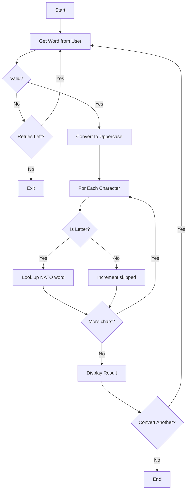

# NATO Phonetic Alphabet - Function Call Flow & Flow Diagram

## Simple Version Call Flow

```
Script Start
  └─> input().upper() → word
  └─> List comprehension: [NATO_ALPHABET[c] for c in word if c in NATO_ALPHABET]
  └─> print(result)
Script End
```

## Production Version Call Graph

```
run()
  ├─> print() welcome banner
  │
  └─> [Main Loop]
        ├─> get_word()
        │     └─> input().strip()
        │     └─> Validate: non-empty, any(c.isalpha())
        │
        ├─> convert_to_nato(word)
        │     └─> for char in word.upper():
        │           ├─> if in NATO_ALPHABET → append NATO word
        │           └─> elif not space → skipped++
        │     └─> return (nato_words, skipped)
        │
        ├─> display_result(word, nato_words, skipped)
        │     └─> " · ".join(nato_words)
        │     └─> print() input, result, stats
        │
        └─> input() convert another?
```

## Mermaid Flow Diagram


