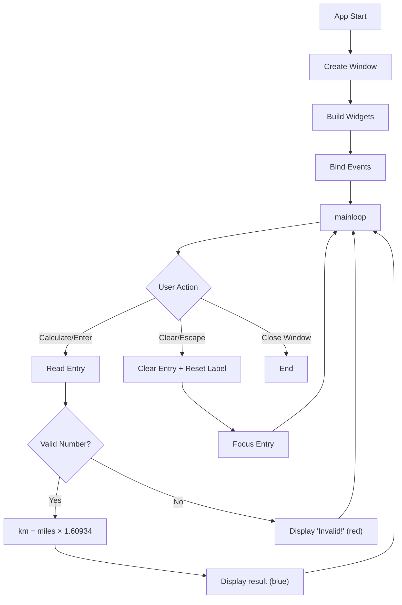

# Mile to Km Converter - Function Call Flow & Flow Diagram

## Simple Version Call Flow

```
Script Start
  └─> tk.Tk() → window
  └─> Create widgets: Entry, Labels × 3, Button
  └─> Grid layout all widgets
  └─> window.mainloop()
        └─> [Event: Button Click]
              └─> convert()
                    ├─> miles_entry.get() → float()
                    ├─> km = miles × 1.60934
                    └─> result_label.config(text=f"{km:.2f}")
```

## Production Version Call Graph

```
__main__
  └─> MileToKmApp()
        └─> __init__
              ├─> tk.Tk() → self.window
              ├─> _build_widgets()
              │     ├─> Entry (miles_entry) + focus()
              │     ├─> Labels × 3 (Miles, is equal to, Km)
              │     ├─> result_label
              │     ├─> Frame (btn_frame)
              │     ├─> Button "Calculate" → self.convert
              │     └─> Button "Clear" → self.clear
              └─> _bind_events()
                    ├─> <Return> → convert()
                    └─> <Escape> → clear()

  └─> app.run()
        └─> window.mainloop()
              ├─> [Event: Calculate / Enter]
              │     └─> convert()
              │           ├─> miles_entry.get().strip()
              │           ├─> float() → may raise ValueError
              │           ├─> km = miles × CONVERSION_FACTOR
              │           └─> result_label.config(text, fg)
              │
              └─> [Event: Clear / Escape]
                    └─> clear()
                          ├─> miles_entry.delete(0, END)
                          ├─> result_label.config(text="0.00")
                          └─> miles_entry.focus()
```

## Mermaid Flow Diagram



## Widget Layout

```
+----------------------------------+
|     [Entry: miles]  Miles        |  Row 0
|     is equal to  [Result]  Km   |  Row 1
|     [Calculate]  [Clear]         |  Row 2
+----------------------------------+
```
