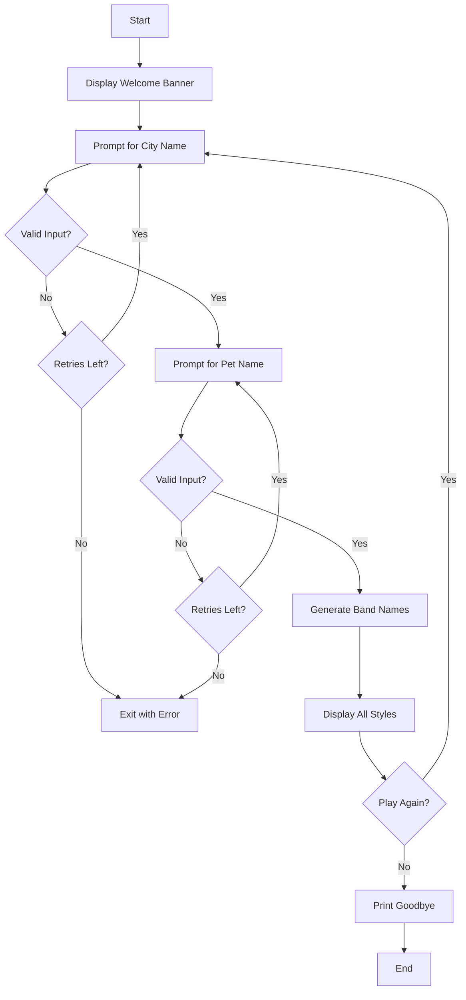
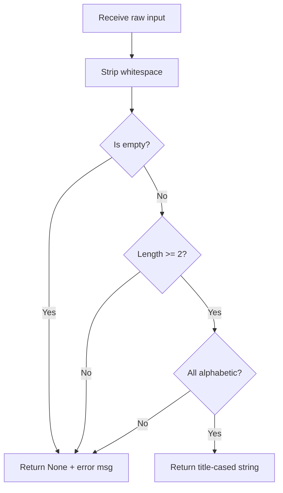

# Band Name Generator - Function Call Flow & Flow Diagram

## Simple Version Call Flow

The simple version is a linear script with no function calls:

```
Script Start
  └─> print() welcome message
  └─> input() city name
  └─> input() pet name
  └─> String concatenation
  └─> print() band name
Script End
```

## Production Version Call Flow

### Entry Point
```
__main__ guard
  └─> run()
```

### Function Call Graph

```
run()
  ├─> display_banner()
  │     └─> print()  (welcome message)
  │
  ├─> get_valid_input("city prompt", "City name")
  │     └─> [loop up to MAX_RETRIES]
  │           ├─> input()
  │           └─> validate_input(raw_text, "City name")
  │                 ├─> str.strip()
  │                 ├─> str.replace().isalpha()
  │                 └─> str.title()  (if valid)
  │
  ├─> get_valid_input("pet prompt", "Pet name")
  │     └─> [same as above]
  │
  ├─> generate_band_names(city, pet)
  │     └─> [loop over BAND_NAME_STYLES.items()]
  │           └─> str.format(city=city, pet=pet)
  │
  ├─> print()  (display results)
  │
  └─> input()  (play again?)
        └─> [if "yes" → loop back to get_valid_input]
        └─> [if not "yes" → break, print goodbye]
```

## Mermaid Flow Diagram



## Validation Flow Detail


