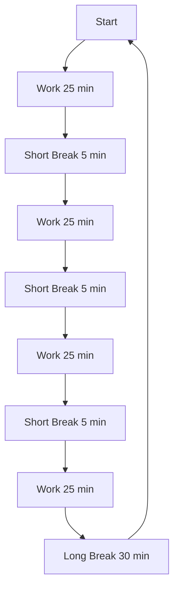
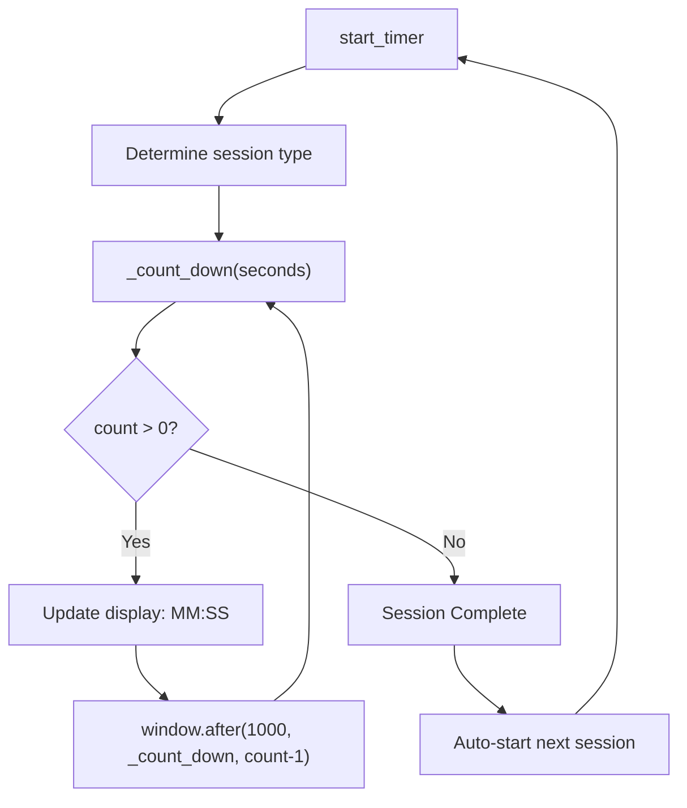
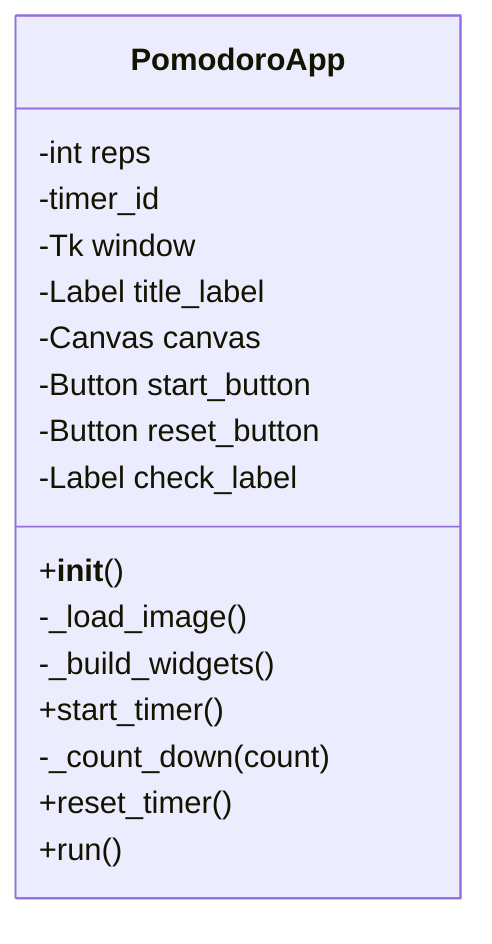

# Pomodoro Timer - Function Call Flow & Flow Diagram

## Production Version Call Graph

```
__main__
  └─> PomodoroApp()
        └─> __init__
              ├─> _load_image()
              │     └─> PIL.Image.open() → ImageTk.PhotoImage()
              │     └─> [fallback] tk.PhotoImage()
              └─> _build_widgets()
                    ├─> title_label (Timer, green)
                    ├─> canvas (tomato image + timer text)
                    ├─> start_button → start_timer
                    ├─> reset_button → reset_timer
                    └─> check_label (checkmarks)

  └─> app.run()
        └─> window.mainloop()

[Event: Start Click]
  └─> start_timer()
        ├─> start_button.config(state="disabled")
        ├─> reps += 1
        ├─> Determine session type (work/short break/long break)
        ├─> title_label.config(text, fg)
        └─> _count_down(seconds)
              ├─> Calculate minutes:seconds
              ├─> canvas.itemconfig(timer_text)
              ├─> if count > 0: window.after(1000, _count_down, count-1)
              └─> if count == 0:
                    ├─> start_timer()  [auto-start next session]
                    └─> if entering break: update checkmarks

[Event: Reset Click]
  └─> reset_timer()
        ├─> window.after_cancel(timer_id)
        ├─> reps = 0
        ├─> title_label.config(text="Timer")
        ├─> canvas.itemconfig(timer_text, text="00:00")
        ├─> check_label.config(text="")
        └─> start_button.config(state="normal")
```

## Mermaid Pomodoro Cycle



## Timer Countdown Flow



## Class Structure


