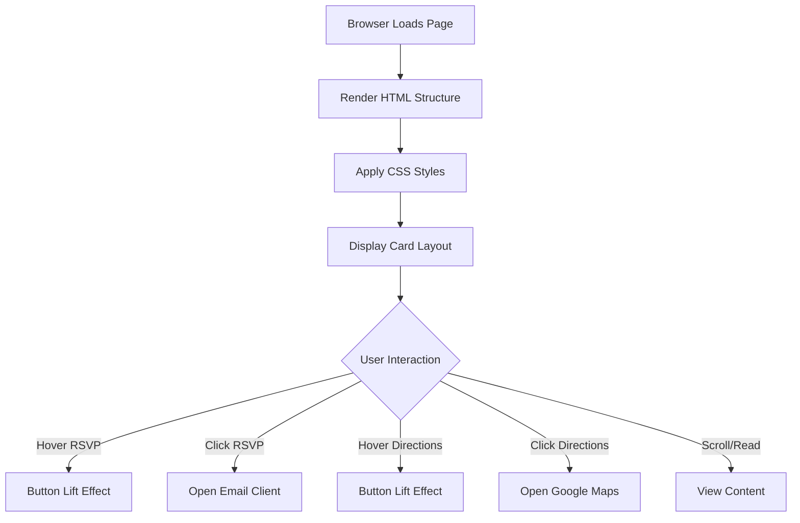
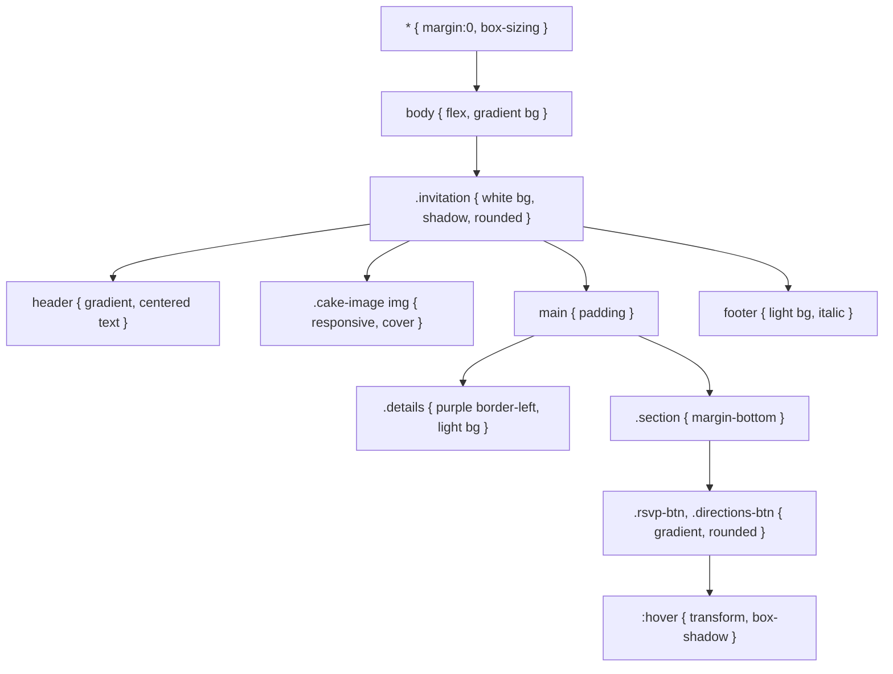

# Birthday Invite - Page Structure & Flow Diagram

## Simple Version Structure

```
<!DOCTYPE html>
  └─> <html>
        ├─> <head>
        │     └─> <title>
        └─> <body>
              ├─> <h1> Title
              ├─> <h2> Subtitle
              ├─>  Cake image
              ├─> <h3> + <ul> Party details
              ├─> <h3> + <p> What to expect
              ├─> <h3> + <p> + <a> RSVP
              ├─> <a> Directions link
              └─> <footer> Closing message
```

## Production Version Structure

```
<!DOCTYPE html>
  └─> <html lang="en">
        ├─> <head>
        │     ├─> <meta charset>
        │     ├─> <meta viewport>
        │     ├─> <title>
        │     └─> <style> (all CSS)
        └─> <body>
              └─> .invitation (card container)
                    ├─> <header>
                    │     ├─> <h1> "You're Invited!"
                    │     └─> <h2> "To My Birthday Party"
                    ├─> .cake-image
                    │     └─>  (responsive, object-fit: cover)
                    ├─> <main>
                    │     ├─> .details (bordered card)
                    │     │     └─> <ul> Date, Time, Venue, Dress
                    │     ├─> .section "What to Expect"
                    │     │     └─> <p> Description
                    │     ├─> .section "RSVP"
                    │     │     └─> <a class="rsvp-btn"> mailto link
                    │     └─> .section "Getting There"
                    │           ├─> <address>
                    │           └─> <a class="directions-btn"> maps link
                    └─> <footer>
                          └─> Closing message
```

## Mermaid Page Flow



## CSS Cascade Structure


