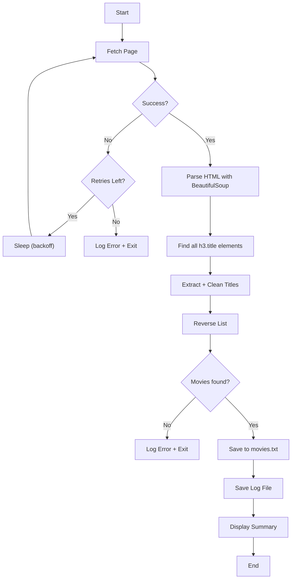
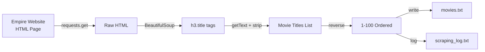

# Web Scraping Movies - Function Call Flow & Flow Diagram

## Simple Version Call Flow

```
Script Start
  └─> requests.get(URL) → response
  └─> response.raise_for_status()
  └─> BeautifulSoup(response.text) → soup
  └─> soup.find_all("h3", class_="title") → movie_tags
  └─> [tag.getText() for tag in movie_tags] → movies
  └─> movies.reverse()
  └─> open(OUTPUT_PATH, "w") → write numbered lines
  └─> print() summary
Script End
```

## Production Version Call Graph

```
run()
  ├─> log_message("Starting...")
  │
  ├─> fetch_page(URL, log_lines)
  │     └─> [Retry loop: up to MAX_RETRIES]
  │           ├─> requests.get(url, headers, timeout)
  │           ├─> response.raise_for_status()
  │           └─> return response.text
  │           └─> [On exception: sleep(attempt * 2), retry]
  │
  ├─> extract_movies(html, log_lines)
  │     ├─> BeautifulSoup(html, "html.parser")
  │     ├─> soup.find_all("h3", class_="title")
  │     ├─> [For each tag: getText, strip, clean numbering]
  │     └─> movies.reverse() → return
  │
  ├─> save_movies(movies, log_lines)
  │     └─> open(OUTPUT_PATH, "w") → write "{i}. {title}\n"
  │
  ├─> print() summary
  │
  └─> save_log(log_lines)
        └─> LOG_PATH.write_text(joined log entries)
```

## Mermaid Flow Diagram



## Data Flow


