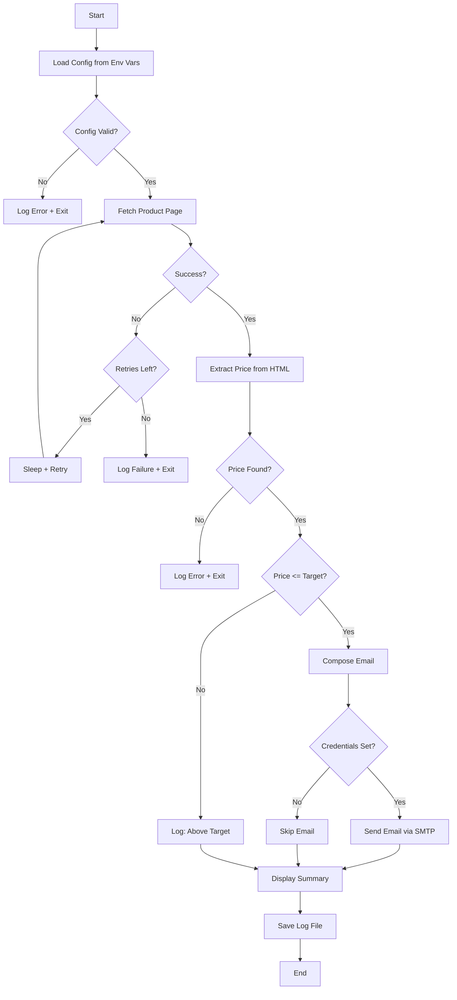
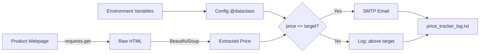

# Price Tracker - Function Call Flow & Flow Diagram

## Simple Version Call Flow

```
Script Start
  └─> get_price()
  │     ├─> requests.get(PRODUCT_URL, headers)
  │     ├─> BeautifulSoup(response.text)
  │     ├─> soup.find(id/class) → price_tag
  │     └─> Clean price text → float
  └─> Compare price with TARGET_PRICE
  └─> if price <= target:
  │     └─> send_email(current_price)
  │           ├─> smtplib.SMTP(server, port)
  │           ├─> smtp.starttls()
  │           ├─> smtp.login()
  │           └─> smtp.sendmail()
  └─> print() result
Script End
```

## Production Version Call Graph

```
run()
  ├─> load_config()
  │     └─> os.environ.get() for each setting
  │     └─> Validate and return Config dataclass
  │
  ├─> fetch_page(url, log_lines)
  │     └─> [Retry loop: MAX_RETRIES]
  │           ├─> requests.get(url, headers, timeout)
  │           ├─> response.raise_for_status()
  │           └─> return response.text
  │
  ├─> extract_price(html, log_lines)
  │     ├─> BeautifulSoup(html, "html.parser")
  │     ├─> [Try multiple selectors]
  │     │     └─> soup.find(**selector)
  │     ├─> getText().strip()
  │     └─> Clean to digits + '.' → float
  │
  ├─> Compare price with config.target_price
  │
  ├─> [If price <= target]:
  │     └─> send_notification(config, price, log_lines)
  │           ├─> MIMEMultipart() message
  │           ├─> smtplib.SMTP(server, port)
  │           ├─> smtp.starttls()
  │           ├─> smtp.login()
  │           └─> smtp.send_message(msg)
  │
  └─> save_log(log_lines)
        └─> Append to price_tracker_log.txt
```

## Mermaid Flow Diagram



## Data Flow


