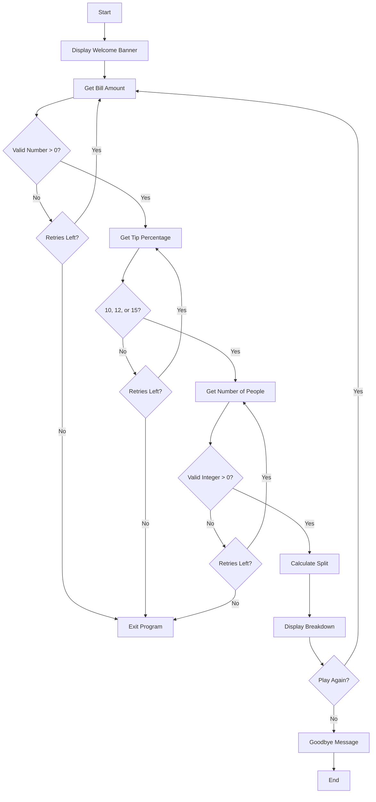
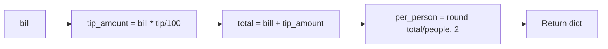

# Tip Calculator - Function Call Flow & Flow Diagram

## Simple Version Call Flow

Linear script — no function calls:

```
Script Start
  └─> print() welcome
  └─> input() → float() bill
  └─> input() → int() tip percentage
  └─> input() → int() number of people
  └─> Calculate tip_amount, total, per_person
  └─> print() result
Script End
```

## Production Version Call Flow

### Entry Point
```
__main__ guard
  └─> run()
```

### Function Call Graph

```
run()
  ├─> print()  (welcome banner)
  │
  ├─> get_bill_amount()
  │     └─> [loop up to MAX_RETRIES]
  │           ├─> input()
  │           ├─> float()  (may raise ValueError)
  │           └─> validation checks
  │
  ├─> get_tip_percentage()
  │     └─> [loop up to MAX_RETRIES]
  │           ├─> input()
  │           ├─> int()  (may raise ValueError)
  │           └─> membership check in VALID_TIP_PERCENTAGES
  │
  ├─> get_number_of_people()
  │     └─> [loop up to MAX_RETRIES]
  │           ├─> input()
  │           ├─> int()  (may raise ValueError)
  │           └─> positive integer check
  │
  ├─> calculate_split(bill, tip_pct, people)
  │     └─> round()  (tip_amount, total, per_person)
  │
  ├─> display_result(bill, tip_pct, people, result)
  │     └─> print()  (formatted breakdown)
  │
  └─> input()  (play again?)
        └─> [if "yes" → loop back]
        └─> [else → break]
```

## Mermaid Flow Diagram



## Calculation Flow Detail


