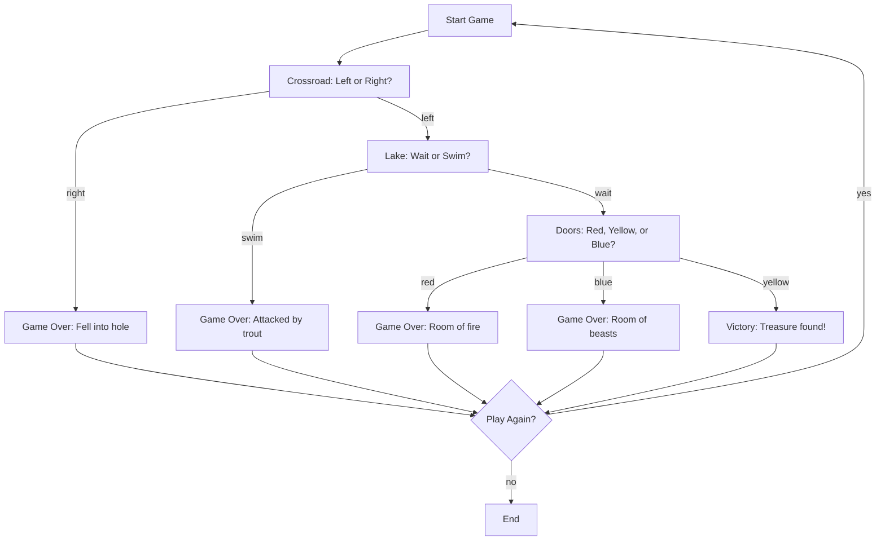
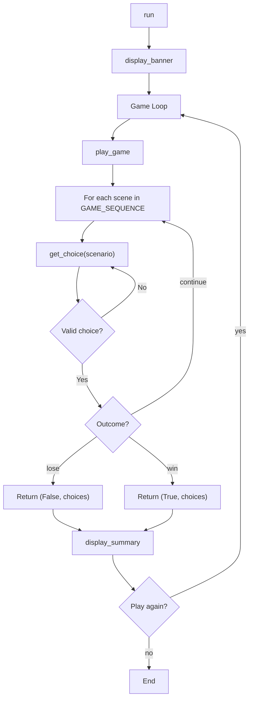

# Treasure Island - Function Call Flow & Flow Diagram

## Simple Version Call Flow

Linear nested-if script:

```
Script Start
  └─> print() ASCII art + welcome
  └─> input().lower() → choice1
  └─> if "left":
  │     └─> input().lower() → choice2
  │     └─> if "wait":
  │           └─> input().lower() → choice3
  │           └─> if "yellow" → Win
  │           └─> elif "red" → Lose
  │           └─> elif "blue" → Lose
  │           └─> else → Lose
  │     └─> else → Lose (swim)
  └─> else → Lose (right)
Script End
```

## Production Version Call Flow

### Entry Point
```
__main__ guard
  └─> run()
```

### Function Call Graph

```
run()
  ├─> display_banner()
  │     └─> print()
  │
  ├─> play_game()
  │     └─> [for each scene_key in GAME_SEQUENCE]
  │           ├─> get_choice(scenario)
  │           │     └─> input().strip().lower()
  │           │     └─> [validate against scenario["options"]]
  │           └─> Check result["outcome"]
  │                 ├─> "lose" → return (False, choices)
  │                 ├─> "win"  → return (True, choices)
  │                 └─> "continue" → next iteration
  │
  ├─> display_summary(won, choices)
  │     └─> print() path, decisions, result
  │
  └─> input() play again?
        └─> "yes" → loop back to play_game()
        └─> else  → break
```

## Mermaid Game Flow Diagram



## Production Code Flow


