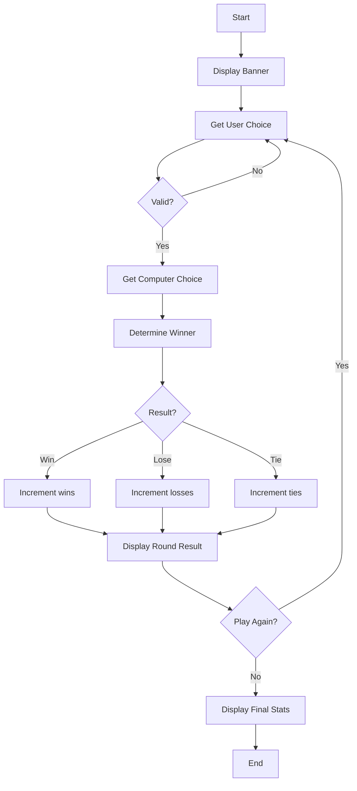
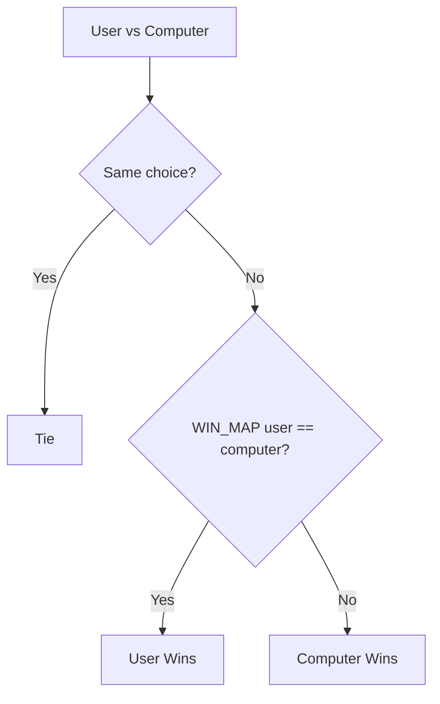

# Rock Paper Scissors - Function Call Flow & Flow Diagram

## Simple Version Call Flow

```
Script Start
  └─> input().lower() → user_choice
  └─> Validate user_choice in choices
  └─> random.choice() → computer_choice
  └─> print() both choices
  └─> Nested if/elif → determine winner
  └─> print() result
Script End
```

## Production Version Call Flow

### Entry Point
```
__main__ guard
  └─> run()
```

### Function Call Graph

```
run()
  ├─> print() welcome banner
  ├─> Initialize scores dict
  │
  └─> [Game Loop]
        ├─> get_user_choice()
        │     └─> input().strip().lower()
        │     └─> [validate against CHOICES, re-prompt if invalid]
        │
        ├─> get_computer_choice()
        │     └─> random.choice(CHOICES)
        │
        ├─> determine_winner(user, computer)
        │     ├─> Check tie (user == computer)
        │     └─> Check WIN_MAP[user] == computer
        │
        ├─> Update scores dict
        │
        ├─> display_round(user, computer, result, scores)
        │     └─> print() choices, result, score
        │
        └─> input() play again?
              ├─> "yes" → loop back
              └─> else → display_final_stats(scores)
                           └─> print() rounds, wins, losses, ties, win rate
```

## Mermaid Flow Diagram



## Winner Determination Logic


