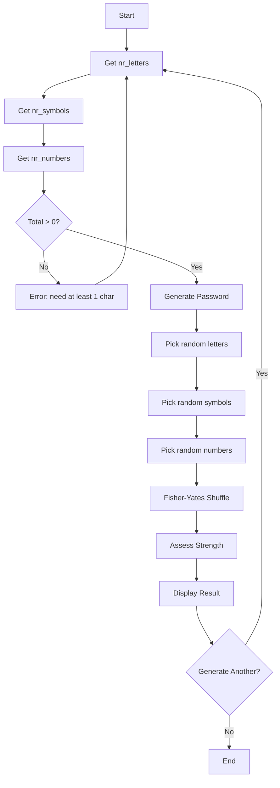
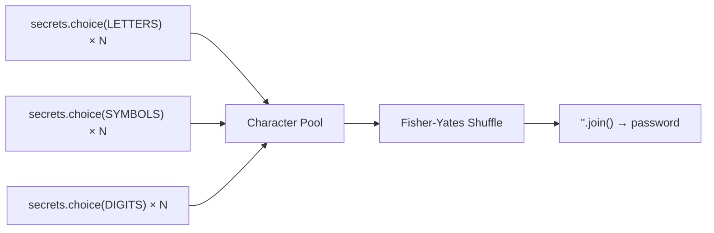

# Password Generator - Function Call Flow & Flow Diagram

## Simple Version Call Flow

```
Script Start
  └─> input() → int() nr_letters
  └─> input() → int() nr_symbols
  └─> input() → int() nr_numbers
  └─> [loop] random.choice(letters) → append to list
  └─> [loop] random.choice(symbols) → append to list
  └─> [loop] random.choice(numbers) → append to list
  └─> random.shuffle(password_list)
  └─> "".join(password_list)
  └─> print() password
Script End
```

## Production Version Call Flow

### Function Call Graph

```
run()
  ├─> print() welcome banner
  │
  ├─> get_non_negative_int("letters") → nr_letters
  │     └─> input().strip() → int() → validate >= 0
  │
  ├─> get_non_negative_int("symbols") → nr_symbols
  ├─> get_non_negative_int("numbers") → nr_numbers
  │
  ├─> Check total > 0
  │
  ├─> generate_password(nr_letters, nr_symbols, nr_numbers)
  │     ├─> secrets.choice(LETTERS) × nr_letters
  │     ├─> secrets.choice(SYMBOLS) × nr_symbols
  │     ├─> secrets.choice(DIGITS) × nr_numbers
  │     └─> Fisher-Yates shuffle with secrets.randbelow()
  │
  ├─> display_result(password, nr_letters, nr_symbols, nr_numbers)
  │     ├─> assess_strength(length, has_letters, has_symbols, has_numbers)
  │     └─> print() password, length, composition, strength
  │
  └─> input() generate another?
        └─> "yes" → loop back
        └─> else → break
```

## Mermaid Flow Diagram



## Password Generation Detail


