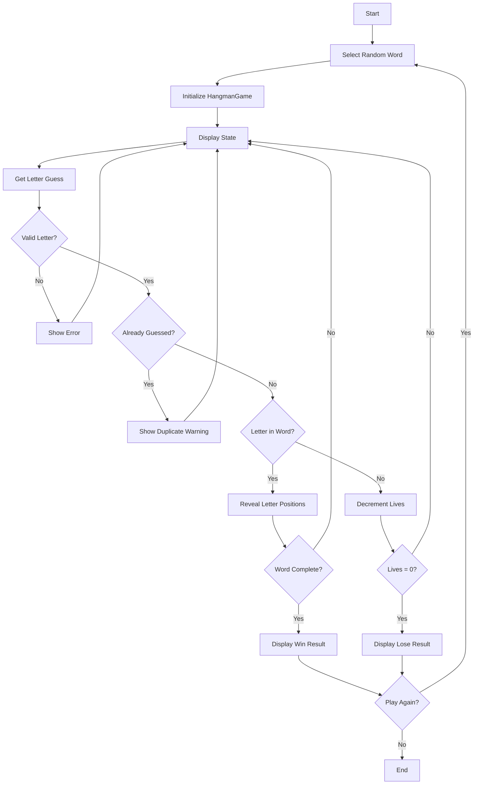
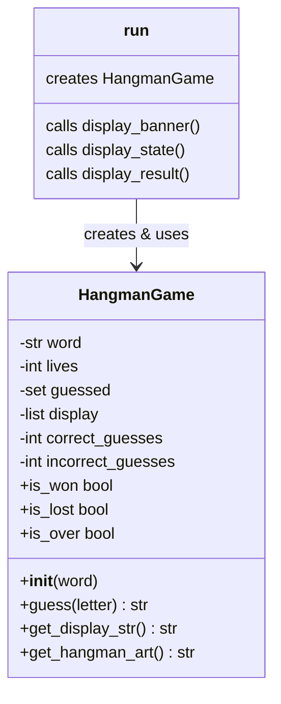

# Hangman - Function Call Flow & Flow Diagram

## Simple Version Call Flow

```
Script Start
  └─> random.choice(WORD_LIST) → word
  └─> Initialize display, lives, guessed_letters
  └─> while lives > 0:
  │     └─> print() word state, lives, guessed
  │     └─> input().lower().strip() → guess
  │     └─> Validate (single alpha, not duplicate)
  │     └─> if guess in word → update display[]
  │     └─> else → lives -= 1, print hangman art
  │     └─> if "_" not in display → print win, break
  └─> else → print game over
Script End
```

## Production Version Call Flow

### Function Call Graph

```
run()
  ├─> display_banner()
  │
  └─> [Game Loop]
        ├─> random.choice(WORD_LIST) → word
        ├─> HangmanGame(word)
        │     └─> __init__: set word, lives, guessed, display
        │
        ├─> [While not game.is_over]
        │     ├─> display_state(game)
        │     │     ├─> game.get_hangman_art() → HANGMAN_STAGES[lives]
        │     │     ├─> game.get_display_str() → " ".join(display)
        │     │     └─> sorted(game.guessed)
        │     │
        │     ├─> input() → raw guess
        │     └─> game.guess(raw)
        │           ├─> Validate (single alpha)
        │           ├─> Check already_guessed (set lookup)
        │           ├─> Add to self.guessed
        │           ├─> Check if letter in self.word
        │           │     ├─> Yes: update self.display[], correct_guesses++
        │           │     └─> No: lives--, incorrect_guesses++
        │           └─> Return result string
        │
        ├─> display_result(game)
        │     └─> Print win/lose, statistics
        │
        └─> input() play again?
```

## Mermaid Flow Diagram



## Class Interaction Diagram


