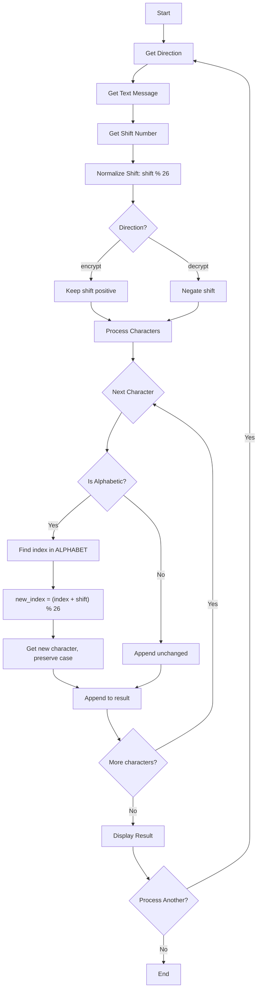
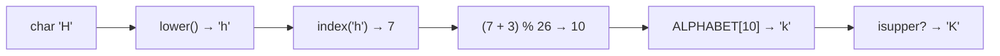

# Caesar Cipher - Function Call Flow & Flow Diagram

## Simple Version Call Flow

```
Script Start
  └─> input() → direction
  └─> input() → text
  └─> input() → int() → shift
  └─> shift % 26
  └─> caesar(text, shift, direction)
  │     └─> if decrypt: shift *= -1
  │     └─> for each char:
  │           ├─> if alpha: index → shift → new_index → new_char
  │           └─> else: preserve char
  └─> print() result
Script End
```

## Production Version Call Flow

### Function Call Graph

```
run()
  ├─> print() welcome banner
  │
  ├─> get_direction()
  │     └─> input().strip().lower()
  │     └─> validate in ("encrypt", "decrypt")
  │
  ├─> get_text()
  │     └─> input().strip()
  │     └─> validate non-empty
  │
  ├─> get_shift()
  │     └─> input().strip() → int()
  │     └─> validate >= 0
  │
  ├─> caesar_cipher(text, shift, direction)
  │     ├─> shift % ALPHABET_SIZE
  │     ├─> if decrypt: shift = -shift
  │     └─> for each char:
  │           ├─> char.lower() in ALPHABET?
  │           │     ├─> ALPHABET.index(char.lower())
  │           │     ├─> (index + shift) % ALPHABET_SIZE
  │           │     └─> ALPHABET[new_index]
  │           └─> else: append unchanged
  │
  ├─> display_result(direction, original, result, shift)
  │     └─> print() operation, shift, texts, char count
  │
  └─> input() process another?
```

## Mermaid Flow Diagram



## Character Shifting Detail


