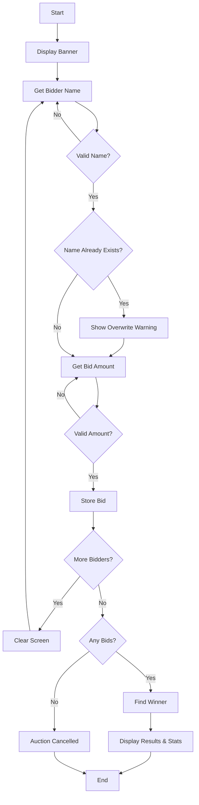
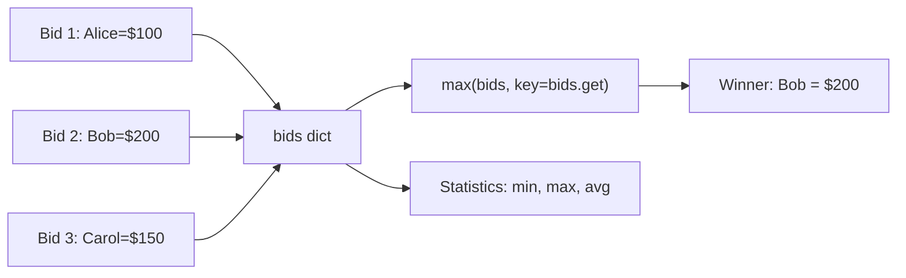

# Blind Auction - Function Call Flow & Flow Diagram

## Simple Version Call Flow

```
Script Start
  └─> print() welcome
  └─> while continue_bidding:
  │     └─> input() → name
  │     └─> input() → float() → bid
  │     └─> bids[name] = bid
  │     └─> input() → more bidders?
  │     └─> if "yes": os.system(clear)
  │     └─> else: continue_bidding = False
  └─> max(bids, key=bids.get) → winner
  └─> print() winner and amount
Script End
```

## Production Version Call Flow

### Function Call Graph

```
run()
  ├─> print() welcome banner
  ├─> Initialize bids dict
  │
  └─> [Bidding Loop]
        ├─> get_bidder_name()
        │     └─> input().strip()
        │     └─> validate: non-empty, alpha+spaces
        │     └─> .title() for formatting
        │
        ├─> Check duplicate name in bids → warning
        │
        ├─> get_bid_amount()
        │     └─> input().strip() → float()
        │     └─> validate: > 0
        │
        ├─> bids[name] = bid
        │
        └─> input() more bidders?
              ├─> "yes" → clear_screen() → os.system()
              └─> else → break → display_results(bids)

display_results(bids)
  ├─> find_winner(bids)
  │     └─> max(bids, key=bids.get)
  │     └─> return (winner_name, winning_bid)
  └─> Calculate and print statistics
        └─> max(), min(), sum()/len() on bids.values()
```

## Mermaid Flow Diagram



## Auction Data Flow


