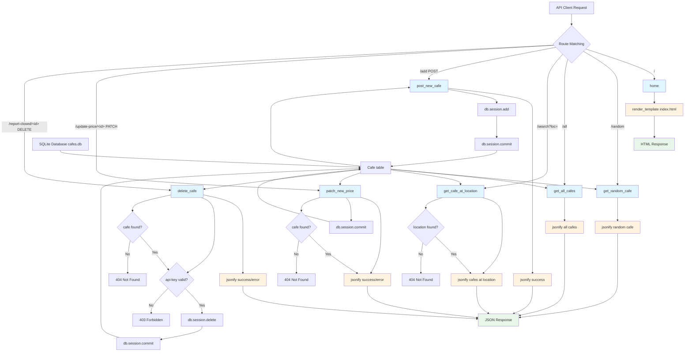

# Cafe API End - Application Analysis

## 1. Function Call Flow

### Entry Points
- **main.py line 142-143**: `if __name__ == '__main__': app.run(debug=True)` - Application startup

### Route Handlers
```
app.run(debug=True)
├── @app.route("/") → home() (line 56-58)
│   └── render_template("index.html")
│
├── @app.route("/random") → get_random_cafe() (line 61-66)
│   ├── db.session.execute(db.select(Cafe)) (line 63)
│   ├── all_cafes = result.scalars().all() (line 64)
│   ├── random_cafe = random.choice(all_cafes) (line 65)
│   └── jsonify(cafe=random_cafe.to_dict()) (line 66)
│
├── @app.route("/all") → get_all_cafes() (line 69-73)
│   ├── db.session.execute(db.select(Cafe).order_by(Cafe.name)) (line 71)
│   ├── all_cafes = result.scalars().all() (line 72)
│   └── jsonify(cafes=[cafe.to_dict() for cafe in all_cafes]) (line 73)
│
├── @app.route("/search") → get_cafe_at_location() (line 76-86)
│   ├── query_location = request.args.get("loc") (line 78)
│   ├── db.session.execute(db.select(Cafe).where(Cafe.location == query_location)) (line 79-80)
│   ├── all_cafes = result.scalars().all() (line 82)
│   ├── if all_cafes: (line 83)
│   │   └── jsonify(cafes=[cafe.to_dict() for cafe in all_cafes]) (line 84)
│   └── else: (line 85)
│       └── jsonify(error={"Not Found": "Sorry, we don't have a cafe at that location."}), 404 (line 86)
│
├── @app.route("/add", methods=["POST"]) → post_new_cafe() (line 91-107)
│   ├── new_cafe = Cafe(...) (line 93-104)
│   │   ├── name=request.form.get("name") (line 94)
│   │   ├── map_url=request.form.get("map_url") (line 95)
│   │   ├── img_url=request.form.get("img_url") (line 96)
│   │   ├── location=request.form.get("loc") (line 97)
│   │   ├── has_sockets=bool(request.form.get("sockets")) (line 98)
│   │   ├── has_toilet=bool(request.form.get("toilet")) (line 99)
│   │   ├── has_wifi=bool(request.form.get("wifi")) (line 100)
│   │   ├── can_take_calls=bool(request.form.get("calls")) (line 101)
│   │   ├── seats=request.form.get("seats") (line 102)
│   │   └── coffee_price=request.form.get("coffee_price") (line 103)
│   ├── db.session.add(new_cafe) (line 105)
│   ├── db.session.commit() (line 106)
│   └── jsonify(response={"success": "Successfully added the new cafe."}) (line 107)
│
├── @app.route("/update-price/<int:cafe_id>", methods=["PATCH"]) → patch_new_price(cafe_id) (line 113-122)
│   ├── new_price = request.args.get("new_price") (line 115)
│   ├── cafe = db.session.get(entity=Cafe, ident=cafe_id) (line 116)
│   ├── if cafe: (line 117)
│   │   ├── cafe.coffee_price = new_price (line 118)
│   │   ├── db.session.commit() (line 119)
│   │   └── jsonify(response={"success": "Successfully updated the price."}), 200 (line 120)
│   └── else: (line 121)
│       └── jsonify(error={"Not Found": "Sorry a cafe with that id was not found in the database."}), 404 (line 122)
│
└── @app.route("/report-closed/<int:cafe_id>", methods=["DELETE"]) → delete_cafe(cafe_id) (line 126-139)
    ├── api_key = request.args.get("api-key") (line 128)
    ├── if api_key == "TopSecretAPIKey": (line 129)
    │   ├── try: cafe = db.get(Cafe, cafe_id) (line 131)
    │   ├── except AttributeError: (line 132)
    │   │   └── jsonify(error={"Not Found": "Sorry a cafe with that id was not found in the database."}), 404 (line 133)
    │   └── else: (line 134)
    │       ├── db.session.delete(cafe) (line 135)
    │       ├── db.session.commit() (line 136)
    │       └── jsonify(response={"success": "Successfully deleted the cafe from the database."}), 200 (line 137)
    └── else: (line 138)
        └── jsonify(error={"Forbidden": "Sorry, that's not allowed. Make sure you have the correct api_key."}), 403 (line 139)
```

### Initialization Flow (lines 1-54)
```
Import statements (lines 1-5)
├── Flask: jsonify, render_template, request
├── flask_sqlalchemy.SQLAlchemy
├── sqlalchemy.orm: DeclarativeBase, Mapped, mapped_column
├── sqlalchemy: Integer, String, Boolean
└── random

Flask App Initialization (line 20)
└── app = Flask(__name__)

Database Configuration (lines 22-53)
├── class Base(DeclarativeBase) (lines 25-26)
├── app.config['SQLALCHEMY_DATABASE_URI'] = 'sqlite:///cafes.db' (line 29)
├── db = SQLAlchemy(model_class=Base) (line 30)
├── db.init_app(app) (line 31)
├── class Cafe(db.Model) (lines 35-49)
│   ├── id: Mapped[int] (primary key)
│   ├── name: Mapped[str] (unique, nullable=False)
│   ├── map_url: Mapped[str] (nullable=False)
│   ├── img_url: Mapped[str] (nullable=False)
│   ├── location: Mapped[str] (nullable=False)
│   ├── seats: Mapped[str] (nullable=False)
│   ├── has_toilet: Mapped[bool] (nullable=False)
│   ├── has_wifi: Mapped[bool] (nullable=False)
│   ├── has_sockets: Mapped[bool] (nullable=False)
│   ├── can_take_calls: Mapped[bool] (nullable=False)
│   ├── coffee_price: Mapped[str] (nullable=True)
│   └── def to_dict(self) (lines 48-49)
└── with app.app_context(): db.create_all() (lines 52-53)
```

### Database Model

#### Cafe Model (lines 35-49)
```
Cafe.__init__() (implicit via SQLAlchemy)
├── id: Mapped[int] (primary key)
├── name: Mapped[str] (unique, nullable=False)
├── map_url: Mapped[str] (nullable=False)
├── img_url: Mapped[str] (nullable=False)
├── location: Mapped[str] (nullable=False)
├── seats: Mapped[str] (nullable=False)
├── has_toilet: Mapped[bool] (nullable=False)
├── has_wifi: Mapped[bool] (nullable=False)
├── has_sockets: Mapped[bool] (nullable=False)
├── can_take_calls: Mapped[bool] (nullable=False)
├── coffee_price: Mapped[str] (nullable=True)
└── to_dict() method (lines 48-49)
    └── Returns dictionary of all column names and values
```

### Helper Methods

#### to_dict() Method (lines 48-49)
```
def to_dict(self):
    return {column.name: getattr(self, column.name) for column in self.__table__.columns}
```
- **Purpose**: Convert Cafe object to dictionary for JSON serialization
- **Returns**: Dictionary with all column names as keys and values as values

---

## 2. Template Rendering Flow

### Template Loading Structure
```
Flask render_template() calls
└── home() → index.html (line 58)
    ├── No context variables
    └── Template location: templates/index.html
```

### Template: index.html
- **Rendered by**: `home()` at main.py line 58
- **Context variables passed**: None
- **Template location**: `templates/index.html`
- **Purpose**: Simple landing page with link to API documentation
- **External link**: Postman documentation (line 9)

### Template Inheritance
- **No template inheritance** - Single standalone HTML file
- **No base templates** - Direct rendering
- **No includes or blocks** - Minimal HTML structure

### Context Data Flow
```
Python → Template Context
└── main.py line 58: (no context) → index.html
```

---

## 3. Template Loop Analysis

### index.html
- **No loops present** - Simple static landing page

### All Other Routes
- **No templates used** - All other routes return JSON responses via jsonify()

---

## 4. Static File References

### CSS File References
- **None** - No CSS files referenced

### JavaScript File References
- **None** - No JavaScript files referenced

### CSS Classes Used
- **None** - No CSS classes used (minimal HTML)

### External Resources

#### Postman Documentation (index.html line 9)
```html
<a href="https://documenter.getpostman.com/view/2568017/TVRhd9qR">Read the Documentation</a>
```
- **Purpose**: Link to API documentation
- **URL**: Postman documentation viewer

### Image/Asset References
- **None** - No images or assets referenced

---

## 5. Data Flow Diagram



### ASCII Art Data Flow
```
┌─────────────────────────────────────────────────────────────────┐
│                      API CLIENT REQUEST                          │
└─────────────────────────┬───────────────────────────────────────┘
                          │
                          ▼
              ┌───────────────────────┐
              │   Flask Router        │
              └───────────┬───────────┘
                          │
    ┌─────────────────────┼─────────────────────┬──────────────┐
    │                     │                     │              │
    ▼                     ▼                     ▼              ▼
┌─────────┐         ┌─────────┐         ┌──────────────┐  ┌──────────┐
│ Route:  │         │ Route:  │         │ Route:       │  │ Route:   │
│   /     │         │ /random │         │ /all         │  │ /search  │
│ home()  │         │get_random│       │ get_all_cafes│  │ get_cafe_ │
└────┬────┘         │cafe()   │         └──────┬───────┘  │at_location│
     │              └────┬────┘                │          └────┬─────┘
     │                   │                      │               │
     │                   ▼                      ▼               ▼
     │            ┌──────────────┐     ┌──────────────┐  ┌──────────────┐
     │            │Query all cafes│     │Query all cafes│  │Query location│
     │            │from DB       │     │ordered by name│  │from DB       │
     │            └──────┬───────┘     └──────┬───────┘  └──────┬───────┘
     │                   │                      │               │
     │                   ▼                      │               │
     │            ┌──────────────┐              │               │
     │            │Random choice │              │               │
     │            └──────┬───────┘              │               │
     │                   │                      │               │
     │                   ▼                      ▼               ▼
     │            ┌──────────────┐     ┌──────────────┐  ┌──────────────┐
     │            │to_dict()     │     │to_dict()     │  │to_dict()     │
     │            │convert to    │     │convert to    │  │convert to    │
     │            │dict          │     │dict          │  │dict          │
     │            └──────┬───────┘     └──────┬───────┘  └──────┬───────┘
     │                   │                      │               │
     ▼                   ▼                      ▼               ▼
┌─────────┐      ┌──────────────┐   ┌──────────────┐  ┌──────────────┐
│render   │      │jsonify()     │   │jsonify()     │  │jsonify()     │
│template │      │JSON response │   │JSON response │  │JSON response │
│index.   │      │single cafe   │   │all cafes     │  │cafes at loc  │
│html     │      └──────┬───────┘   └──────┬───────┘  └──────┬───────┘
└────┬────┘             │                   │               │
     │                  │                   │               │
     ▼                  │                   │               │
┌─────────┐             │                   │               │
│HTML     │             │                   │               │
│Response │             │                   │               │
└─────────┘             │                   │               │
                        │                   │               │
                        └─────────┬─────────┴───────────────┘
                                  ▼
                        ┌──────────────────┐
                        │  JSON Response   │
                        │  to API Client   │
                        └──────────────────┘

┌─────────────────────────────────────────────────────────────────┐
│                    POST /add (Create Cafe)                       │
└─────────────────────────────────────────────────────────────────┘

┌──────────────┐
│ POST /add    │
│ Form Data     │
└──────┬───────┘
       │
       ▼
┌──────────────┐
│ Extract form │
│ data from    │
│ request.form │
└──────┬───────┘
       │
       ▼
┌──────────────┐
│ Create Cafe  │
│ object with  │
│ form data    │
└──────┬───────┘
       │
       ▼
┌──────────────┐
│ db.session.  │
│ add(new_cafe)│
└──────┬───────┘
       │
       ▼
┌──────────────┐
│ db.session.  │
│ commit()     │
└──────┬───────┘
       │
       ▼
┌──────────────┐
│ jsonify()    │
│ success      │
│ response     │
└──────┬───────┘
       │
       ▼
┌──────────────┐
│ JSON Response│
│ to Client    │
└──────────────┘

┌─────────────────────────────────────────────────────────────────┐
│              PATCH /update-price/<id> (Update Price)              │
└─────────────────────────────────────────────────────────────────┘

┌──────────────────┐
│ PATCH /update-   │
│ price/<cafe_id>?  │
│ new_price=£5.67  │
└────────┬─────────┘
         │
         ▼
┌──────────────────┐
│ Extract new_price │
│ from request.args│
└────────┬─────────┘
         │
         ▼
┌──────────────────┐
│ db.session.get() │
│ Find cafe by id  │
└────────┬─────────┘
         │
         ▼
┌──────────────────┐
│ Cafe found?      │
└────────┬─────────┘
         │
    ┌────┴────┐
    │         │
    ▼         ▼
┌──────┐  ┌──────────┐
│ Yes  │  │ No       │
└──┬───┘  └────┬─────┘
   │           │
   ▼           ▼
┌──────┐  ┌──────────┐
│Update│  │jsonify() │
│price │  │404 error │
└──┬───┘  └────┬─────┘
   │           │
   ▼           │
┌──────┐       │
│commit│       │
└──┬───┘       │
   │           │
   ▼           │
┌──────┐       │
│jsonify│       │
│success│       │
└──┬───┘       │
   │           │
   └─────┬─────┘
         ▼
┌──────────────────┐
│ JSON Response   │
│ to Client       │
└──────────────────┘

┌─────────────────────────────────────────────────────────────────┐
│          DELETE /report-closed/<id> (Delete Cafe)               │
└─────────────────────────────────────────────────────────────────┘

┌──────────────────┐
│ DELETE /report-  │
│ closed/<cafe_id>? │
│ api-key=TopSecret│
│ APIKey           │
└────────┬─────────┘
         │
         ▼
┌──────────────────┐
│ Extract api-key   │
│ from request.args│
└────────┬─────────┘
         │
         ▼
┌──────────────────┐
│ api-key ==       │
│ "TopSecretAPIKey"│
└────────┬─────────┘
         │
    ┌────┴────┐
    │         │
    ▼         ▼
┌──────┐  ┌──────────┐
│ Yes  │  │ No       │
└──┬───┘  └────┬─────┘
   │           │
   ▼           ▼
┌──────┐  ┌──────────┐
│db.get│  │jsonify() │
│cafe  │  │403 error │
└──┬───┘  └────┬─────┘
   │           │
   ▼           │
┌──────┐       │
│Cafe  │       │
│found?│       │
└──┬───┘       │
   │           │
┌──┴───┐       │
│ Yes  │       │
│ No   │       │
└──┬───┘       │
   │           │
   ▼           │
┌──────┐       │
│delete│       │
│cafe  │       │
└──┬───┘       │
   │           │
   ▼           │
┌──────┐       │
│commit│       │
└──┬───┘       │
   │           │
   ▼           │
┌──────┐       │
│jsonify│       │
│success│       │
└──┬───┘       │
   │           │
   └─────┬─────┘
         ▼
┌──────────────────┐
│ JSON Response   │
│ to Client       │
└──────────────────┘
```

---

## 6. Written Summary

### Application Architecture
This is a **RESTful API for managing cafe data** built with Flask and SQLAlchemy. It follows a **simple API architecture pattern**:
- **Model**: SQLAlchemy ORM model (Cafe) for database representation
- **Controller**: Flask routes handling HTTP methods (GET, POST, PATCH, DELETE)
- **No View Layer** (except simple landing page) - Returns JSON responses
- **Database**: SQLite for data persistence

### Request Lifecycle Walkthrough

#### 1. Application Startup
1. Python executes `main.py`
2. Imports Flask, SQLAlchemy, and dependencies (lines 1-5)
3. Initializes Flask application (line 20)
4. Configures SQLite database (line 29)
5. Defines Cafe model with all fields (lines 35-49)
6. Implements `to_dict()` method for JSON serialization (lines 48-49)
7. Creates database tables if they don't exist (lines 52-53)
8. Starts development server with debug mode (line 143)

#### 2. Homepage Request (`/`)
1. API client or browser navigates to `http://localhost:5000/`
2. Flask router matches route to `home()` function
3. Function renders `index.html` with no context
4. Simple HTML page displayed with link to Postman documentation
5. HTML response returned

#### 3. Random Cafe Request (`/random`)
1. API client sends GET request to `/random`
2. Flask router matches route to `get_random_cafe()` function
3. Function queries database for all cafes (line 63)
4. Converts result to list of Cafe objects (line 64)
5. Selects random cafe from list (line 65)
6. Converts cafe object to dictionary using `to_dict()` (line 66)
7. Returns JSON response with single cafe data (line 66)
8. JSON response: `{"cafe": {...}}`

#### 4. All Cafes Request (`/all`)
1. API client sends GET request to `/all`
2. Flask router matches route to `get_all_cafes()` function
3. Function queries database for all cafes ordered by name (line 71)
4. Converts result to list of Cafe objects (line 72)
5. Converts each cafe to dictionary using list comprehension (line 73)
6. Returns JSON response with all cafes (line 73)
7. JSON response: `{"cafes": [{...}, {...}, ...]}`

#### 5. Search by Location Request (`/search`)
1. API client sends GET request to `/search?loc=<location>`
2. Flask router matches route to `get_cafe_at_location()` function
3. Function extracts location from query parameters (line 78)
4. Queries database for cafes matching location (line 79-80)
5. Converts result to list of Cafe objects (line 82)
6. **If cafes found**: Returns JSON with cafes (line 84)
7. **If no cafes found**: Returns JSON error with 404 status (line 86)
8. JSON response: `{"cafes": [{...}, ...]}` or `{"error": {"Not Found": "..."}}` with 404

#### 6. Add New Cafe Request (`/add` - POST)
1. API client sends POST request to `/add` with form data
2. Flask router matches route to `post_new_cafe()` function
3. Function extracts form data from request.form (lines 94-103)
4. Creates new Cafe object with form data (line 93-104)
5. Boolean fields converted using bool() (lines 98-101)
6. Adds new cafe to database session (line 105)
7. Commits transaction to database (line 106)
8. Returns JSON success response (line 107)
9. JSON response: `{"response": {"success": "Successfully added the new cafe."}}`
10. HTTP status: 200 (default)

#### 7. Update Price Request (`/update-price/<cafe_id>` - PATCH)
1. API client sends PATCH request to `/update-price/<cafe_id>?new_price=<price>`
2. Flask router matches dynamic route to `patch_new_price(cafe_id)` function
3. Function extracts new_price from query parameters (line 115)
4. Queries database for cafe by ID (line 116)
5. **If cafe found**:
   - Updates coffee_price field (line 118)
   - Commits transaction (line 119)
   - Returns JSON success with 200 status (line 120)
6. **If cafe not found**:
   - Returns JSON error with 404 status (line 122)
7. JSON response: `{"response": {"success": "..."}}` or `{"error": {"Not Found": "..."}}`

#### 8. Delete Cafe Request (`/report-closed/<cafe_id>` - DELETE)
1. API client sends DELETE request to `/report-closed/<cafe_id>?api-key=<key>`
2. Flask router matches dynamic route to `delete_cafe(cafe_id)` function
3. Function extracts api-key from query parameters (line 128)
4. **If api-key == "TopSecretAPIKey"**:
   - Queries database for cafe by ID (line 131)
   - **If cafe found**:
     - Deletes cafe from database (line 135)
     - Commits transaction (line 136)
     - Returns JSON success with 200 status (line 137)
   - **If cafe not found** (AttributeError):
     - Returns JSON error with 404 status (line 133)
5. **If api-key invalid**:
   - Returns JSON error with 403 Forbidden status (line 139)
6. JSON response: Success, 404, or 403 with appropriate error message

### Key Files and Responsibilities

#### main.py (4908 bytes)
- **Lines 1-5**: Import statements
- **Line 20**: Flask app initialization
- **Lines 25-31**: Database configuration
- **Lines 35-49**: Cafe model definition
- **Lines 48-49**: to_dict() method for JSON serialization
- **Lines 52-53**: Database table creation
- **Lines 56-58**: Homepage route
- **Lines 61-66**: Random cafe route
- **Lines 69-73**: All cafes route
- **Lines 76-86**: Search by location route
- **Lines 91-107**: Add new cafe route (POST)
- **Lines 113-122**: Update price route (PATCH)
- **Lines 126-139**: Delete cafe route (DELETE)
- **Lines 142-143**: Application startup

#### requirements.txt (57 bytes)
- **Flask==3.0.0**: Web framework
- **flask_sqlalchemy==3.1.1**: ORM integration
- **SQLAlchemy==2.0.25**: Database toolkit

#### templates/index.html (267 bytes)
- **Lines 1-6**: HTML head and title
- **Lines 7-10**: Body with heading and documentation link
- **Purpose**: Simple landing page for API

### Configuration
- **Debug mode**: Enabled (`debug=True`)
- **Host**: Default (127.0.0.1)
- **Port**: Default (5000)
- **Template folder**: `templates/` (Flask default)
- **Database**: SQLite (`sqlite:///cafes.db`)
- **API Key**: "TopSecretAPIKey" (hardcoded for delete endpoint)

### Database
- **Type**: SQLite
- **Location**: `instance/cafes.db`
- **ORM**: SQLAlchemy 2.0.25
- **Table**: `cafes`
- **Fields**:
  - id: Integer (primary key)
  - name: String(250, unique, nullable=False)
  - map_url: String(500, nullable=False)
  - img_url: String(500, nullable=False)
  - location: String(250, nullable=False)
  - seats: String(250, nullable=False)
  - has_toilet: Boolean (nullable=False)
  - has_wifi: Boolean (nullable=False)
  - has_sockets: Boolean (nullable=False)
  - can_take_calls: Boolean (nullable=False)
  - coffee_price: String(250, nullable=True)
- **Data persistence**: Persistent (SQLite file)

### Security Considerations
- API key hardcoded as "TopSecretAPIKey" (line 129)
- No authentication/authorization for most endpoints
- No input validation on form data
- No rate limiting
- No HTTPS enforcement
- Debug mode enabled (not production-ready)
- SQL injection protection via SQLAlchemy ORM
- API key transmitted in query parameters (insecure)

### Technology Stack
- **Framework**: Flask 3.0.0 (Python web framework)
- **ORM**: SQLAlchemy 2.0.25 with Flask-SQLAlchemy
- **Database**: SQLite
- **Templating**: Jinja2 (Flask's default) - minimal use
- **API Format**: JSON
- **HTTP Methods**: GET, POST, PATCH, DELETE

### API Endpoints Summary

#### GET Endpoints
- **GET /**: Landing page (HTML)
- **GET /random**: Random cafe (JSON)
- **GET /all**: All cafes (JSON)
- **GET /search?loc=<location>**: Cafes at location (JSON)

#### POST Endpoints
- **POST /add**: Add new cafe (JSON)
  - Form fields: name, map_url, img_url, loc, sockets, toilet, wifi, calls, seats, coffee_price

#### PATCH Endpoints
- **PATCH /update-price/<cafe_id>?new_price=<price>**: Update cafe price (JSON)

#### DELETE Endpoints
- **DELETE /report-closed/<cafe_id>?api-key=<key>**: Delete cafe (JSON)
  - Requires valid API key

### External Dependencies
- **None** - Self-contained API with no external service dependencies
- **Postman Documentation**: External documentation hosted at documenter.getpostman.com

### Testing Notes
- **Recommended testing tool**: Postman
- **POST /add**: Test with x-www-form-urlencoded body (line 88 comment)
- **DELETE /report-closed**: Requires api-key query parameter
- **PATCH /update-price**: Requires new_price query parameter
- **GET /search**: Requires loc query parameter
