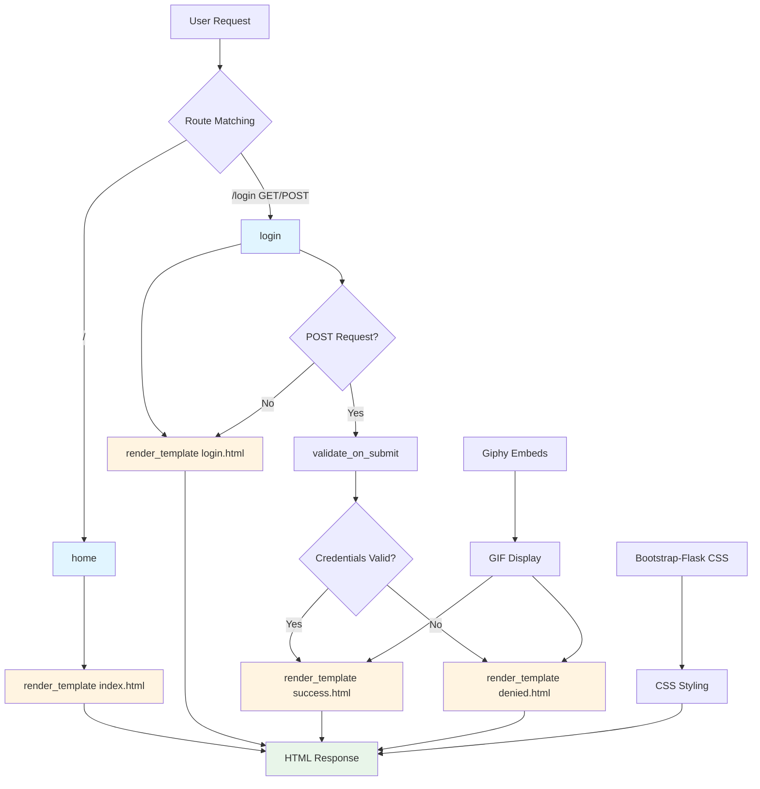

# Flask Secrets End - Application Analysis

## 1. Function Call Flow

### Entry Points
- **main.py line 47-48**: `if __name__ == '__main__': app.run(debug=True, port=5001)` - Application startup

### Route Handlers
```
app.run(debug=True, port=5001)
├── @app.route("/") → home() (line 31-33)
│   └── render_template('index.html')
│
└── @app.route("/login", methods=["GET", "POST"]) → login() (line 36-44)
    ├── login_form = LoginForm() (line 38)
    ├── if login_form.validate_on_submit(): (line 39)
    │   ├── if login_form.email.data == "admin@email.com" and login_form.password.data == "12345678": (line 40)
    │   │   └── render_template("success.html") (line 41)
    │   └── else: (line 42)
    │       └── render_template("denied.html") (line 43)
    └── render_template("login.html", form=login_form) (line 44)
```

### Initialization Flow (lines 1-29)
```
Import statements (lines 1-5)
├── Flask: render_template
├── flask_wtf.FlaskForm
├── wtforms: StringField, PasswordField, SubmitField
├── wtforms.validators: DataRequired, Email, Length
└── flask_bootstrap.Bootstrap5

Form Class Definition (lines 21-24)
├── class LoginForm(FlaskForm) (line 21)
│   ├── email = StringField('Email', validators=[DataRequired()]) (line 22)
│   ├── password = PasswordField('Password', validators=[DataRequired()]) (line 23)
│   └── submit = SubmitField(label="Log In") (line 24)

Flask App Configuration (lines 27-29)
├── app = Flask(__name__) (line 27)
├── app.secret_key = "any-string-you-want-just-keep-it-secret" (line 28)
└── bootstrap = Bootstrap5(app) (line 29)
```

### Form Class

#### LoginForm (lines 21-24)
```
LoginForm fields:
├── email: StringField(validators=[DataRequired()])
├── password: PasswordField(validators=[DataRequired()])
└── submit: SubmitField(label="Log In")
```

### Decorators and Middleware
- **None** - No custom decorators or middleware used

---

## 2. Template Rendering Flow

### Template Loading Structure
```
Flask render_template() calls
├── home() → index.html (line 33)
│   ├── No context variables
│   ├── Extends: base.html (line 1)
│   └── Blocks: title, content
│
├── login() → login.html (line 44)
│   ├── Context: form=login_form
│   ├── Extends: base.html (line 1)
│   ├── Imports: render_form from bootstrap5/form.html (line 2)
│   └── Blocks: title, content
│
├── login() → success.html (line 41)
│   ├── No context variables
│   ├── Extends: base.html (line 1)
│   └── Blocks: title, content
│
└── login() → denied.html (line 43)
    ├── No context variables
    ├── Extends: base.html (line 1)
    └── Blocks: title, content
```

### Template: base.html
- **Extended by**: All templates (index.html, login.html, success.html, denied.html)
- **Template location**: `templates/base.html`
- **Purpose**: Provides HTML structure, Bootstrap CSS, and block structure
- **CSS reference**: `{{ bootstrap.load_css() }}` (line 9) - Bootstrap-Flask CSS
- **Blocks**:
  - `styles` (lines 7-10) - For additional CSS
  - `title` (line 12) - For page title
  - `content` (line 15) - For page content

### Template: index.html
- **Rendered by**: `home()` at main.py line 33
- **Context variables passed**: None
- **Template location**: `templates/index.html`
- **Extends**: base.html (line 1)
- **Title**: "Secrets" (line 2)
- **Content**: Welcome message with login button (lines 3-11)
- **Bootstrap classes**: jumbotron, container, btn, btn-primary, btn-lg

### Template: login.html
- **Rendered by**: `login()` at main.py line 44
- **Context variables passed**: `form` (LoginForm instance)
- **Template location**: `templates/login.html`
- **Extends**: base.html (line 1)
- **Imports**: `render_form` from bootstrap5/form.html (line 2)
- **Title**: "Login" (line 3)
- **Content**: Login form rendered via Bootstrap-Flask macro (lines 4-8)
- **Bootstrap classes**: container

### Template: success.html
- **Rendered by**: `login()` at main.py line 41 (on successful authentication)
- **Context variables passed**: None
- **Template location**: `templates/success.html`
- **Extends**: base.html (line 1)
- **Title**: "Access Granted" (line 2)
- **Content**: "Top Secret" message with Giphy iframe (lines 3-8)
- **External resource**: Giphy embed (line 6)

### Template: denied.html
- **Rendered by**: `login()` at main.py line 43 (on failed authentication)
- **Context variables passed**: None
- **Template location**: `templates/denied.html`
- **Extends**: base.html (line 1)
- **Title**: "Access Denied" (line 2)
- **Content**: "Access Denied" message with Giphy iframe (lines 3-8)
- **External resource**: Giphy embed (line 6)

### Template Inheritance
- **Template inheritance using ** - All templates extend base.html
- **Base template**: base.html provides structure and Bootstrap CSS
- **Blocks**: All templates use `` and `` blocks
- **Bootstrap-Flask integration**: Uses `render_form` macro from bootstrap5/form.html

### Context Data Flow
```
Python → Template Context
├── main.py line 33: (no context) → index.html
│
├── main.py line 44: form=login_form → login.html
│   └── LoginForm → {{ render_form(form) }}
│
├── main.py line 41: (no context) → success.html
│
└── main.py line 43: (no context) → denied.html
```

---

## 3. Template Loop Analysis

### index.html
- **No loops present** - Static content with single button

### login.html
- **No loops present** - Form rendered via Bootstrap-Flask macro

### success.html
- **No loops present** - Static content with iframe

### denied.html
- **No loops present** - Static content with iframe

### base.html
- **No loops present** - Base structure only

---

## 4. Static File References

### CSS File References

#### base.html (line 9)
```html
{{ bootstrap.load_css() }}
```
- **CSS file**: Bootstrap CSS (loaded via Bootstrap-Flask extension)
- **Purpose**: Bootstrap CSS framework

### JavaScript File References
- **None** - No JavaScript files referenced

### CSS Classes Used (Bootstrap)

#### Bootstrap Classes
**Layout:**
- `.jumbotron` - Hero section styling (index.html line 5)
- `.container` - Container for content (all templates)

**Typography:**
- `.h1` - Heading level 1 (all templates)

**Buttons:**
- `.btn` - Button base (index.html line 9)
- `.btn-primary` - Primary button (index.html line 9)
- `.btn-lg` - Large button (index.html line 9)

### External Resources

#### Giphy Embeds (success.html line 6, denied.html line 6)
```html
<iframe src="https://giphy.com/embed/Ju7l5y9osyymQ" ...></iframe>
<iframe src="https://giphy.com/embed/1xeVd1vr43nHO" ...></iframe>
```
- **Purpose**: Display GIFs for success/denied states
- **External service**: Giphy (giphy.com)

### Image/Asset References
- **None** - No local images referenced

---

## 5. Data Flow Diagram



### ASCII Art Data Flow
```
┌─────────────────────────────────────────────────────────────────┐
│                        USER REQUEST                              │
└─────────────────────────┬───────────────────────────────────────┘
                          │
                          ▼
              ┌───────────────────────┐
              │   Flask Router        │
              └───────────┬───────────┘
                          │
            ┌─────────────┴─────────────┐
            │                           │
            ▼                           ▼
    ┌───────────────┐         ┌──────────────┐
    │ Route: /      │         │ Route: /login │
    │ home()        │         │ login()       │
    └───────┬───────┘         └──────┬───────┘
            │                       │
            │                       │
            ▼                       │
    ┌───────────────┐             │
    │render_template │             │
    │index.html     │             │
    └───────┬───────┘             │
            │                       │
            │                       │
            │                       ▼
            │              ┌──────────────┐
            │              │ GET Request? │
            │              └──────┬───────┘
            │                     │
            │                     ▼
            │              ┌──────────────┐
            │              │render_template│
            │              │login.html    │
            │              │form=LoginForm│
            │              └──────┬───────┘
            │                     │
            │                     │
            │                     ▼
            │              ┌──────────────┐
            │              │User submits  │
            │              │login form    │
            │              └──────┬───────┘
            │                     │
            │                     ▼
            │              ┌──────────────┐
            │              │POST Request  │
            │              └──────┬───────┘
            │                     │
            │                     ▼
            │              ┌──────────────┐
            │              │validate_on_  │
            │              │submit()      │
            │              └──────┬───────┘
            │                     │
            │                     ▼
            │              ┌──────────────┐
            │              │Check email == │
            │              │admin@email.  │
            │              │com AND pwd == │
            │              │12345678      │
            │              └──────┬───────┘
            │                     │
            │            ┌────────┴────────┐
            │            │                 │
            │            ▼                 ▼
            │       ┌──────────┐    ┌──────────┐
            │       │Valid     │    │Invalid   │
            │       │Credentials│    │Credentials│
            │       └────┬─────┘    └────┬─────┘
            │            │                 │
            │            ▼                 ▼
            │       ┌──────────┐    ┌──────────┐
            │       │render_   │    │render_   │
            │       │template  │    │template  │
            │       │success.  │    │denied.   │
            │       │html      │    │html      │
            │       └────┬─────┘    └────┬─────┘
            │            │                 │
            └────────────┴─────────────────┘
                         │
                         ▼
              ┌──────────────────┐
              │  HTML Response   │
              │  + Bootstrap CSS │
              │  + Giphy Embeds  │
              └────────┬─────────┘
                       │
                       ▼
              ┌──────────────────┐
              │   Browser Render │
              └──────────────────┘
```

---

## 6. Written Summary

### Application Architecture
This is a **simple Flask authentication application** demonstrating form validation and basic authentication logic. It follows a **minimal MVC pattern**:
- **Model**: WTForms form class (LoginForm) for form handling
- **View**: HTML templates with Jinja2 template inheritance
- **Controller**: Flask routes handling form validation and authentication logic

### Request Lifecycle Walkthrough

#### 1. Application Startup
1. Python executes `main.py`
2. Imports Flask, WTForms, Flask-Bootstrap, and dependencies (lines 1-5)
3. Defines LoginForm class with email, password, and submit fields (lines 21-24)
4. Initializes Flask application (line 27)
5. Sets secret key for form CSRF protection (line 28)
6. Initializes Bootstrap5 extension (line 29)
7. Starts development server on port 5001 with debug mode (line 48)

#### 2. Homepage Request (`/`)
1. User navigates to `http://localhost:5001/`
2. Flask router matches route to `home()` function
3. Function renders `index.html` with no context (line 33)
4. Template extends `base.html`
5. Base template loads Bootstrap CSS via Bootstrap-Flask
6. Index template displays welcome message in jumbotron
7. Login button links to `/login` route
8. Bootstrap CSS applied
9. HTML response returned to browser

#### 3. Login Page Request (`/login` - GET)
1. User clicks "Login" button on homepage
2. Flask router matches route to `login()` function
3. Function creates LoginForm instance (line 38)
4. **GET request**: Renders `login.html` with `form=login_form` context (line 44)
5. Template extends `base.html`
6. Template imports `render_form` macro from bootstrap5/form.html (line 2)
7. Template renders login form using Bootstrap-Flask macro (line 7)
8. Bootstrap CSS applied to form elements
9. HTML response returned to browser

#### 4. Login Form Submission (`/login` - POST)
1. User submits login form with email and password
2. Flask router matches route to `login()` function
3. Function creates LoginForm instance (line 38)
4. **POST request**: Form validation via `validate_on_submit()` (line 39)
5. WTForms validates:
   - Email field is not empty (DataRequired validator)
   - Password field is not empty (DataRequired validator)
   - CSRF token validation (automatic)
6. If validation passes:
   - Checks if email == "admin@email.com" AND password == "12345678" (line 40)
   - **If credentials valid**: Renders `success.html` (line 41)
   - **If credentials invalid**: Renders `denied.html` (line 43)
7. If validation fails:
   - Re-renders `login.html` with form and validation errors (line 44)
8. HTML response returned to browser

#### 5. Success Page Display
1. User successfully authenticates
2. Flask router renders `success.html`
3. Template extends `base.html`
4. Template displays "Top Secret" heading
5. Template embeds Giphy GIF (Rick Astley - Never Gonna Give You Up)
6. Bootstrap CSS applied
7. HTML response returned to browser

#### 6. Denied Page Display
1. User fails authentication
2. Flask router renders `denied.html`
3. Template extends `base.html`
4. Template displays "Access Denied" heading
5. Template embeds Giphy GIF (dog fail)
6. Bootstrap CSS applied
7. HTML response returned to browser

### Key Files and Responsibilities

#### main.py (1431 bytes)
- **Lines 1-5**: Import statements
- **Lines 7-18**: Installation instructions (comments)
- **Lines 21-24**: LoginForm class definition
- **Lines 27-29**: Flask app initialization and extensions
- **Lines 31-33**: Homepage route
- **Lines 36-44**: Login route with authentication logic
- **Lines 47-48**: Application startup

#### requirements.txt (87 bytes)
- **Bootstrap_Flask==2.2.0**: Bootstrap integration
- **Flask==2.3.2**: Web framework
- **WTForms==3.0.1**: Form handling
- **Flask_WTF==1.2.1**: Flask-WTF integration
- **Werkzeug==3.0.0**: Security utilities

#### templates/base.html (388 bytes)
- **Lines 1-13**: HTML head with Bootstrap CSS
- **Lines 7-10**: Styles block for Bootstrap CSS
- **Line 12**: Title block
- **Lines 14-15**: Body with content block
- **Purpose**: Base template with Bootstrap integration

#### templates/index.html (353 bytes)
- **Line 1**: Extends base.html
- **Line 2**: Title block
- **Lines 3-11**: Content with jumbotron and login button
- **Purpose**: Homepage with welcome message

#### templates/login.html (241 bytes)
- **Line 1**: Extends base.html
- **Line 2**: Import render_form macro
- **Line 3**: Title block
- **Lines 4-8**: Content with login form
- **Purpose**: Login page with form

#### templates/success.html (386 bytes)
- **Line 1**: Extends base.html
- **Line 2**: Title block
- **Lines 3-8**: Content with Giphy embed
- **Purpose**: Success page after authentication

#### templates/denied.html (404 bytes)
- **Line 1**: Extends base.html
- **Line 2**: Title block
- **Lines 3-8**: Content with Giphy embed
- **Purpose**: Denied page after failed authentication

### Configuration
- **Debug mode**: Enabled (`debug=True`)
- **Host**: Default (127.0.0.1)
- **Port**: 5001 (custom)
- **Template folder**: `templates/` (Flask default)
- **Static folder**: `static/` (Flask default - not used)
- **SECRET_KEY**: "any-string-you-want-just-keep-it-secret" (placeholder)

### Database
- **No database** - Hardcoded credentials
- **Data persistence**: None
- **Authentication method**: Hardcoded comparison (line 40)
- **Credentials**: 
  - Email: admin@email.com
  - Password: 12345678

### Security Considerations
- Hardcoded credentials in source code (line 40)
- No password hashing
- No user authentication system
- No session management
- No CSRF protection beyond Flask-WTF defaults
- SECRET_KEY is placeholder (not production-ready)
- Debug mode enabled (not production-ready)
- No rate limiting on login attempts
- No input validation beyond WTForms validators
- No HTTPS enforcement

### Technology Stack
- **Framework**: Flask 2.3.2 (Python web framework)
- **Form Handling**: WTForms 3.0.1 with Flask-WTF 1.2.1
- **CSS Framework**: Bootstrap 5 via Bootstrap-Flask 2.2.0
- **Templating**: Jinja2 (Flask's default)
- **Security**: Werkzeug 3.0.0

### External Dependencies
- **Bootstrap 5**: CSS framework (loaded via Bootstrap-Flask)
- **Giphy**: GIF embeds for success/denied pages

### Authentication Flow
1. User enters email and password
2. WTForms validates form data
3. Hardcoded credential check
4. Success → Display "Top Secret" page with GIF
5. Failure → Display "Access Denied" page with GIF

### Limitations
- Single hardcoded user account
- No user registration
- No password recovery
- No session management
- No logout functionality
- No password encryption
- Not suitable for production use
