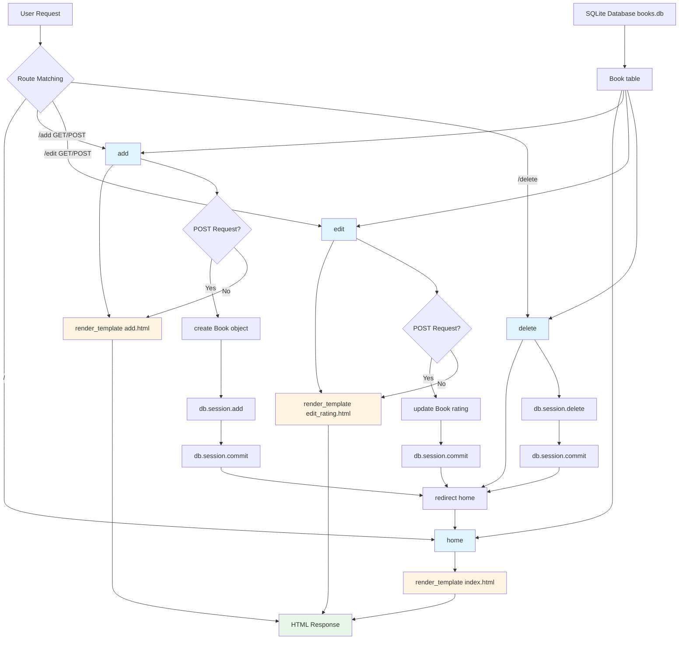

# Library Project End - Application Analysis

## 1. Function Call Flow

### Entry Points
- **main.py line 101-102**: `if __name__ == "__main__": app.run(debug=True)` - Application startup

### Route Handlers
```
app.run(debug=True)
├── @app.route('/') → home() (line 49-56)
│   ├── db.session.execute(db.select(Book).order_by(Book.title)) (line 53)
│   ├── all_books = result.scalars().all() (line 55)
│   └── render_template("index.html", books=all_books) (line 56)
│
├── @app.route("/add", methods=["GET", "POST"]) → add() (line 59-71)
│   ├── if request.method == "POST": (line 61)
│   │   ├── new_book = Book(...) (line 63-67)
│   │   │   ├── title=request.form["title"] (line 64)
│   │   │   ├── author=request.form["author"] (line 65)
│   │   │   └── rating=request.form["rating"] (line 66)
│   │   ├── db.session.add(new_book) (line 68)
│   │   ├── db.session.commit() (line 69)
│   │   └── return redirect(url_for('home')) (line 70)
│   └── render_template("add.html") (line 71)
│
├── @app.route("/edit", methods=["GET", "POST"]) → edit() (line 74-85)
│   ├── if request.method == "POST": (line 76)
│   │   ├── book_id = request.form["id"] (line 78)
│   │   ├── book_to_update = db.get_or_404(Book, book_id) (line 79)
│   │   ├── book_to_update.rating = request.form["rating"] (line 80)
│   │   ├── db.session.commit() (line 81)
│   │   └── return redirect(url_for('home')) (line 82)
│   ├── book_id = request.args.get('id') (line 83)
│   ├── book_selected = db.get_or_404(Book, book_id) (line 84)
│   └── render_template("edit_rating.html", book=book_selected) (line 85)
│
└── @app.route("/delete") → delete() (line 88-98)
    ├── book_id = request.args.get('id') (line 90)
    ├── book_to_delete = db.get_or_404(Book, book_id) (line 93)
    ├── db.session.delete(book_to_delete) (line 96)
    ├── db.session.commit() (line 97)
    └── return redirect(url_for('home')) (line 98)
```

### Initialization Flow (lines 1-46)
```
Import statements (lines 1-4)
├── Flask: render_template, request, redirect, url_for
├── flask_sqlalchemy.SQLAlchemy
├── sqlalchemy.orm: DeclarativeBase, Mapped, mapped_column
└── sqlalchemy: Integer, String, Float

Flask App Initialization (line 19)
└── app = Flask(__name__)

Database Configuration (lines 21-46)
├── class Base(DeclarativeBase) (lines 24-25)
├── app.config['SQLALCHEMY_DATABASE_URI'] = "sqlite:///books.db" (line 28)
├── db = SQLAlchemy(model_class=Base) (line 30)
├── db.init_app(app) (line 32)
├── class Book(db.Model) (lines 36-41)
│   ├── id: Mapped[int] (primary key) (line 37)
│   ├── title: Mapped[str] (unique, nullable=False) (lines 38-39)
│   ├── author: Mapped[str] (nullable=False) (line 40)
│   └── rating: Mapped[float] (nullable=False) (line 41)
└── with app.app_context(): db.create_all() (lines 45-46)
```

### Database Model

#### Book Model (lines 36-41)
```
Book.__init__() (implicit via SQLAlchemy)
├── id: Mapped[int] (primary key)
├── title: Mapped[str] (unique, nullable=False)
├── author: Mapped[str] (nullable=False)
└── rating: Mapped[float] (nullable=False)
```

---

## 2. Template Rendering Flow

### Template Loading Structure
```
Flask render_template() calls
├── home() → index.html (line 56)
│   ├── Context: books=all_books
│   └── Template location: templates/index.html
│
├── add() → add.html (line 71)
│   ├── No context variables
│   └── Template location: templates/add.html
│
└── edit() → edit_rating.html (line 85)
    ├── Context: book=book_selected
    └── Template location: templates/edit_rating.html
```

### Template: index.html
- **Rendered by**: `home()` at main.py line 56
- **Context variables passed**: `books` (list of Book objects)
- **Template location**: `templates/index.html`
- **Purpose**: Display all books with edit and delete options
- **Conditional display**: Shows "Library is empty" if no books (line 9-11)

### Template: add.html
- **Rendered by**: `add()` at main.py line 71
- **Context variables passed**: None
- **Template location**: `templates/add.html`
- **Form action**: `{{ url_for('add') }}` (line 8)
- **Form method**: POST (line 8)
- **Form fields**: title, author, rating

### Template: edit_rating.html
- **Rendered by**: `edit()` at main.py line 85
- **Context variables passed**: `book` (Book object)
- **Template location**: `templates/edit_rating.html`
- **Form action**: `{{ url_for('edit') }}` (line 8)
- **Form method**: POST (line 8)
- **Hidden field**: book.id (line 11)
- **Form fields**: rating (new rating)
- **Display**: Shows current book title and rating (lines 9-10)

### Template Inheritance
- **No template inheritance** - All templates are standalone HTML files
- **No base templates** - Direct rendering without Jinja2 inheritance
- **No includes or blocks** - No shared components

### Context Data Flow
```
Python → Template Context
├── main.py line 56: books=all_books → index.html
│   └── all_books (list of Book objects) → 
│
├── main.py line 71: (no context) → add.html
│
└── main.py line 85: book=book_selected → edit_rating.html
    └── book_selected (Book object) → {{book.title}}, {{book.rating}}, {{book.id}}
```

---

## 3. Template Loop Analysis

### index.html Loop (lines 13-19)
```jinja2

    <li>
        <a href="{{ url_for('delete', id=book.id) }}">Delete</a>
        {{book.title}} - {{book.author}} - {{book.rating}}/10
        <a href="{{ url_for('edit', id=book.id) }}">Edit Rating</a>
    </li>

```

**Loop Details:**
- **Data source**: `books` (list of Book objects)
- **Provided by**: `home()` function at main.py line 53-55
- **Iteration variable**: `book` (individual Book object)
- **Variables available inside loop**:
  - `book.id` - Book ID (used in URL generation)
  - `book.title` - Book title
  - `book.author` - Book author
  - `book.rating` - Book rating
- **HTML elements rendered per iteration**:
  - `<li>` - List item
  - `<a href="{{ url_for('delete', id=book.id) }}">Delete</a>` - Delete link
  - `{{book.title}} - {{book.author}} - {{book.rating}}/10` - Book information
  - `<a href="{{ url_for('edit', id=book.id) }}">Edit Rating</a>` - Edit link

### add.html
- **No loops present** - Form-based page

### edit_rating.html
- **No loops present** - Form-based page

---

## 4. Static File References

### CSS File References
- **None** - No CSS files referenced

### JavaScript File References
- **None** - No JavaScript files referenced

### CSS Classes Used
- **None** - No CSS classes used (minimal HTML without styling)

### External Resources
- **None** - No external resources referenced

### Image/Asset References
- **None** - No images or assets referenced

---

## 5. Data Flow Diagram



### ASCII Art Data Flow
```
┌─────────────────────────────────────────────────────────────────┐
│                        USER REQUEST                              │
└─────────────────────────┬───────────────────────────────────────┘
                          │
                          ▼
              ┌───────────────────────┐
              │   Flask Router        │
              └───────────┬───────────┘
                          │
    ┌─────────────────────┼─────────────────────┬──────────────┐
    │                     │                     │              │
    ▼                     ▼                     ▼              ▼
┌─────────┐         ┌─────────┐         ┌──────────────┐  ┌──────────┐
│ Route:  │         │ Route:  │         │ Route:       │  │ Route:   │
│   /     │         │ /add    │         │ /edit        │  │ /delete  │
│ home()  │         │ add()   │         │ edit()       │  │ delete() │
└────┬────┘         └────┬────┘         └──────┬───────┘  └────┬─────┘
     │                   │                     │               │
     │                   │                     │               │
     │                   ▼                     │               │
     │            ┌──────────────┐            │               │
     │            │ POST?        │            │               │
     │            └──────┬───────┘            │               │
     │              Yes │              No     │               │
     │                   ▼                     │               │
     │            ┌──────────────┐            │               │
     │            │Extract form  │            │               │
     │            │data          │            │               │
     │            └──────┬───────┘            │               │
     │                   │                     │               │
     │                   ▼                     │               │
     │            ┌──────────────┐            │               │
     │            │Create Book   │            │               │
     │            │object        │            │               │
     │            └──────┬───────┘            │               │
     │                   │                     │               │
     │                   ▼                     │               │
     │            ┌──────────────┐            │               │
     │            │db.session.   │            │               │
     │            │add()         │            │               │
     │            └──────┬───────┘            │               │
     │                   │                     │               │
     │                   ▼                     │               │
     │            ┌──────────────┐            │               │
     │            │db.session.   │            │               │
     │            │commit()      │            │               │
     │            └──────┬───────┘            │               │
     │                   │                     │               │
     │                   ▼                     │               │
     │            ┌──────────────┐            │               │
     │            │redirect home │            │               │
     │            └──────┬───────┘            │               │
     │                   │                     │               │
     │                   │                     ▼               │
     │                   │            ┌──────────────┐        │
     │                   │            │ GET request? │        │
     │                   │            └──────┬───────┘        │
     │                   │                   │                │
     │                   │                   ▼                │
     │                   │            ┌──────────────┐        │
     │                   │            │Extract book_id│        │
     │                   │            │from query     │        │
     │                   │            │params         │        │
     │                   │            └──────┬───────┘        │
     │                   │                   │                │
     │                   │                   ▼                │
     │                   │            ┌──────────────┐        │
     │                   │            │Query DB for  │        │
     │                   │            │book by id    │        │
     │                   │            └──────┬───────┘        │
     │                   │                   │                │
     │                   │                   ▼                │
     │                   │            ┌──────────────┐        │
     │                   │            │render        │        │
     │                   │            │edit_rating.  │        │
     │                   │            │html          │        │
     │                   │            └──────┬───────┘        │
     │                   │                   │                │
     │                   │                   │                │
     │                   │            User submits edit form
     │                   │                   │
     │                   │                   ▼
     │                   │            ┌──────────────┐        │
     │                   │            │POST request  │        │
     │                   │            └──────┬───────┘        │
     │                   │                   │                │
     │                   │                   ▼                │
     │                   │            ┌──────────────┐        │
     │                   │            │Extract form  │        │
     │                   │            │data          │        │
     │                   │            └──────┬───────┘        │
     │                   │                   │                │
     │                   │                   ▼                │
     │                   │            ┌──────────────┐        │
     │                   │            │Update book   │        │
     │                   │            │rating        │        │
     │                   │            └──────┬───────┘        │
     │                   │                   │                │
     │                   │                   ▼                │
     │                   │            ┌──────────────┐        │
     │                   │            │db.session.   │        │
     │                   │            │commit()      │        │
     │                   │            └──────┬───────┘        │
     │                   │                   │                │
     │                   │                   ▼                │
     │                   │            ┌──────────────┐        │
     │                   │            │redirect home │        │
     │                   │            └──────┬───────┘        │
     │                   │                   │                │
     │                   │                   │                │
     │                   │                   ▼                │
     │                   │            ┌──────────────┐        │
     │                   │            │Extract book_id│        │
     │                   │            │from query     │        │
     │                   │            │params         │        │
     │                   │            └──────┬───────┘        │
     │                   │                   │                │
     │                   │                   ▼                │
     │                   │            ┌──────────────┐        │
     │                   │            │Query DB for  │        │
     │                   │            │book by id    │        │
     │                   │            └──────┬───────┘        │
     │                   │                   │                │
     │                   │                   ▼                │
     │                   │            ┌──────────────┐        │
     │                   │            │db.session.   │        │
     │                   │            │delete()      │        │
     │                   │            └──────┬───────┘        │
     │                   │                   │                │
     │                   │                   ▼                │
     │                   │            ┌──────────────┐        │
     │                   │            │db.session.   │        │
     │                   │            │commit()      │        │
     │                   │            └──────┬───────┘        │
     │                   │                   │                │
     │                   │                   ▼                │
     │                   │            ┌──────────────┐        │
     │                   │            │redirect home │        │
     │                   │            └──────┬───────┘        │
     │                   │                   │                │
     └───────────────────┴───────────────────┴────────────────┘
                              │
                              ▼
                    ┌──────────────────┐
                    │Query all books   │
                    │ordered by title  │
                    └────────┬─────────┘
                             │
                             ▼
                    ┌──────────────────┐
                    │render_template  │
                    │index.html       │
                    │books=all_books  │
                    └────────┬─────────┘
                             │
                             ▼
                    ┌──────────────────┐
                    │  HTML Response   │
                    │  (no CSS)        │
                    └────────┬─────────┘
                             │
                             ▼
                    ┌──────────────────┐
                    │   Browser Render │
                    └──────────────────┘
```

---

## 6. Written Summary

### Application Architecture
This is a **simple CRUD (Create, Read, Update, Delete) library management application** built with Flask and SQLAlchemy. It follows a **minimal MVC pattern**:
- **Model**: SQLAlchemy ORM model (Book) for database representation
- **View**: HTML templates with Jinja2
- **Controller**: Flask routes handling CRUD operations

### Request Lifecycle Walkthrough

#### 1. Application Startup
1. Python executes `main.py`
2. Imports Flask, SQLAlchemy, and dependencies (lines 1-4)
3. Initializes Flask application (line 19)
4. Configures SQLite database (line 28)
5. Defines Book model with id, title, author, rating (lines 36-41)
6. Creates database tables if they don't exist (lines 45-46)
7. Starts development server with debug mode (line 102)

#### 2. Homepage Request (`/`)
1. User navigates to `http://localhost:5000/`
2. Flask router matches route to `home()` function
3. Function queries database for all books ordered by title (line 53)
4. Converts result to list of Book objects (line 55)
5. Renders `index.html` with `books=all_books` context (line 56)
6. Template checks if library is empty (line 9-11)
7. Template iterates through books using Jinja2 loop (lines 13-19)
8. Each book displays title, author, rating, with Delete and Edit links
9. HTML response returned to browser

#### 3. Add Book Request (`/add`)
1. User clicks "Add New Book" link on homepage
2. Flask router matches route to `add()` function
3. **GET request**: Renders `add.html` with no context (line 71)
4. Add book form displayed with title, author, rating fields
5. **POST request** (form submission):
   - Extracts form data from request.form (lines 64-66)
   - Creates new Book object with form data (line 63-67)
   - Adds new book to database session (line 68)
   - Commits transaction to database (line 69)
   - Redirects to homepage (line 70)
6. HTML response returned to browser

#### 4. Edit Rating Request (`/edit`)
1. User clicks "Edit Rating" link on homepage
2. URL generated: `/edit?id=<book.id>` using `url_for()`
3. Flask router matches route to `edit()` function
4. **GET request**:
   - Extracts book_id from query parameters (line 83)
   - Queries database for book by ID (line 84)
   - Renders `edit_rating.html` with `book=book_selected` context (line 85)
5. Template displays current book title and rating (lines 9-10)
6. Template includes hidden field with book.id (line 11)
7. Template displays input for new rating (line 12)
8. **POST request** (form submission):
   - Extracts book_id from form data (line 78)
   - Queries database for book by ID (line 79)
   - Updates book rating with form data (line 80)
   - Commits transaction to database (line 81)
   - Redirects to homepage (line 82)
9. HTML response returned to browser

#### 5. Delete Book Request (`/delete`)
1. User clicks "Delete" link on homepage
2. URL generated: `/delete?id=<book.id>` using `url_for()`
3. Flask router matches route to `delete()` function
4. Extracts book_id from query parameters (line 90)
5. Queries database for book by ID (line 93)
6. Deletes book from database session (line 96)
7. Commits transaction to database (line 97)
8. Redirects to homepage (line 98)
9. Book no longer appears in book list

### Key Files and Responsibilities

#### main.py (2951 bytes)
- **Lines 1-4**: Import statements
- **Lines 6-17**: Installation instructions (comments)
- **Line 19**: Flask app initialization
- **Lines 21-32**: Database configuration
- **Lines 36-41**: Book model definition
- **Lines 45-46**: Database table creation
- **Lines 49-56**: Homepage route (READ)
- **Lines 59-71**: Add book route (CREATE)
- **Lines 74-85**: Edit rating route (UPDATE)
- **Lines 88-98**: Delete book route (DELETE)
- **Lines 101-102**: Application startup

#### requirements.txt (57 bytes)
- **Flask==3.0.0**: Web framework
- **flask_sqlalchemy==3.1.1**: ORM integration
- **SQLAlchemy==2.0.25**: Database toolkit

#### templates/index.html (568 bytes)
- **Lines 1-6**: HTML head and title
- **Lines 8-11**: Conditional message for empty library
- **Lines 12-20**: Book list with edit/delete links
- **Line 21**: Add new book link
- **Purpose**: Display all books with CRUD operations

#### templates/add.html (466 bytes)
- **Lines 1-6**: HTML head and title
- **Lines 7-16**: Add book form
- **Purpose**: Form to add new books

#### templates/edit_rating.html (470 bytes)
- **Lines 1-6**: HTML head and title
- **Lines 7-14**: Edit rating form
- **Purpose**: Form to edit book rating

### Configuration
- **Debug mode**: Enabled (`debug=True`)
- **Host**: Default (127.0.0.1)
- **Port**: Default (5000)
- **Template folder**: `templates/` (Flask default)
- **Static folder**: `static/` (Flask default - not used)
- **Database**: SQLite (`sqlite:///books.db`)

### Database
- **Type**: SQLite
- **Location**: `instance/books.db`
- **ORM**: SQLAlchemy 2.0.25
- **Table**: `books`
- **Fields**:
  - id: Integer (primary key)
  - title: String(250, unique, nullable=False)
  - author: String(250, nullable=False)
  - rating: Float (nullable=False)
- **Data persistence**: Persistent (SQLite file)

### Security Considerations
- No authentication/authorization
- No input validation on form data
- No CSRF protection
- No rate limiting
- No HTTPS enforcement
- Debug mode enabled (not production-ready)
- SQL injection protection via SQLAlchemy ORM
- No validation on rating range (should be 0-10)
- No user accounts or permissions

### Technology Stack
- **Framework**: Flask 3.0.0 (Python web framework)
- **ORM**: SQLAlchemy 2.0.25 with Flask-SQLAlchemy
- **Database**: SQLite
- **Templating**: Jinja2 (Flask's default)
- **No CSS framework**: Plain HTML without styling

### External Dependencies
- **None** - Self-contained application with no external service dependencies

### CRUD Operations Summary

#### CREATE (POST /add)
- **Form fields**: title, author, rating
- **Action**: Adds new book to database
- **Redirect**: Homepage

#### READ (GET /)
- **Action**: Retrieves all books ordered by title
- **Display**: Shows list with edit/delete options

#### UPDATE (POST /edit)
- **Form fields**: rating (new rating)
- **Hidden field**: id (book identifier)
- **Action**: Updates book rating
- **Redirect**: Homepage

#### DELETE (GET /delete)
- **Query parameter**: id (book identifier)
- **Action**: Deletes book from database
- **Redirect**: Homepage

### Limitations
- No styling (plain HTML)
- No user authentication
- No input validation beyond database constraints
- No confirmation for delete operations
- No search or filtering
- No pagination
- No sorting options (hardcoded by title)
- Rating is free-text (should be validated as number 0-10)
- Not suitable for production use
