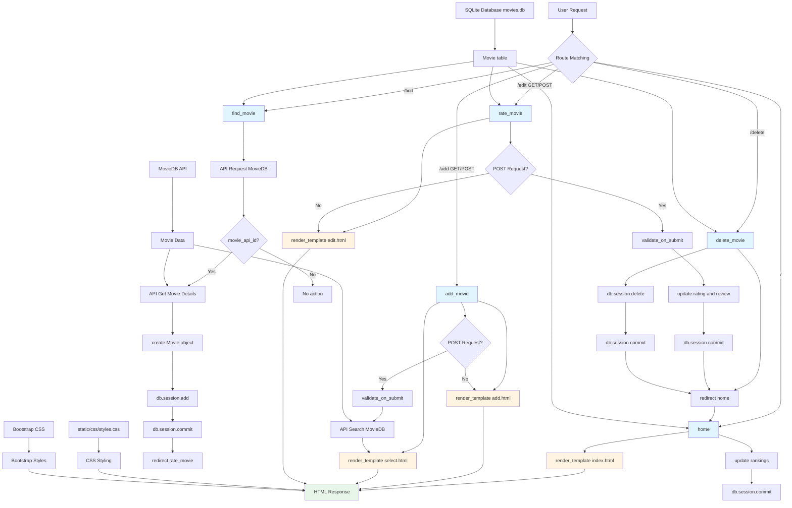

# Top Movies End - Application Analysis

## 1. Function Call Flow

### Entry Points
- **main.py line 133-134**: `if __name__ == '__main__': app.run(debug=True)` - Application startup

### Route Handlers
```
app.run(debug=True)
├── @app.route("/") → home() (line 68-77)
│   ├── db.session.execute(db.select(Movie).order_by(Movie.rating)) (line 70)
│   ├── all_movies = result.scalars().all() (line 71)
│   ├── for i in range(len(all_movies)): (line 73)
│   │   └── all_movies[i].ranking = len(all_movies) - i (line 74)
│   ├── db.session.commit() (line 75)
│   └── render_template("index.html", movies=all_movies) (line 77)
│
├── @app.route("/add", methods=["GET", "POST"]) → add_movie() (line 80-89)
│   ├── form = FindMovieForm() (line 82)
│   ├── if form.validate_on_submit(): (line 83)
│   │   ├── movie_title = form.title.data (line 84)
│   │   ├── response = requests.get(MOVIE_DB_SEARCH_URL, params={...}) (line 85-86)
│   │   ├── data = response.json()["results"] (line 87)
│   │   └── render_template("select.html", options=data) (line 88)
│   └── render_template("add.html", form=form) (line 89)
│
├── @app.route("/find") → find_movie() (line 92-108)
│   ├── movie_api_id = request.args.get("id") (line 94)
│   ├── if movie_api_id: (line 95)
│   │   ├── movie_api_url = f"{MOVIE_DB_INFO_URL}/{movie_api_id}" (line 96)
│   │   ├── response = requests.get(movie_api_url, params={...}) (line 97-98)
│   │   ├── data = response.json() (line 99)
│   │   ├── new_movie = Movie(...) (line 100-105)
│   │   │   ├── title=data["title"] (line 101)
│   │   │   ├── year=data["release_date"].split("-")[0] (line 102)
│   │   │   ├── img_url=f"{MOVIE_DB_IMAGE_URL}{data['poster_path']}" (line 103)
│   │   │   └── description=data["overview"] (line 104)
│   │   ├── db.session.add(new_movie) (line 106)
│   │   ├── db.session.commit() (line 107)
│   │   └── return redirect(url_for("rate_movie", id=new_movie.id)) (line 108)
│
├── @app.route("/edit", methods=["GET", "POST"]) → rate_movie() (line 111-121)
│   ├── form = RateMovieForm() (line 113)
│   ├── movie_id = request.args.get("id") (line 114)
│   ├── movie = db.get_or_404(Movie, movie_id) (line 115)
│   ├── if form.validate_on_submit(): (line 116)
│   │   ├── movie.rating = float(form.rating.data) (line 117)
│   │   ├── movie.review = form.review.data (line 118)
│   │   ├── db.session.commit() (line 119)
│   │   └── return redirect(url_for('home')) (line 120)
│   └── render_template("edit.html", movie=movie, form=form) (line 121)
│
└── @app.route("/delete") → delete_movie() (line 124-130)
    ├── movie_id = request.args.get("id") (line 126)
    ├── movie = db.get_or_404(Movie, movie_id) (line 127)
    ├── db.session.delete(movie) (line 128)
    ├── db.session.commit() (line 129)
    └── return redirect(url_for("home")) (line 130)
```

### Initialization Flow (lines 1-66)
```
Import statements (lines 1-9)
├── Flask: render_template, redirect, url_for, request
├── flask_bootstrap.Bootstrap5
├── flask_sqlalchemy.SQLAlchemy
├── sqlalchemy.orm: DeclarativeBase, Mapped, mapped_column
├── sqlalchemy: Integer, String, Float
├── flask_wtf.FlaskForm
├── wtforms: StringField, SubmitField
├── wtforms.validators: DataRequired
└── requests

API Configuration (lines 25-28)
├── MOVIE_DB_API_KEY = "USE_YOUR_OWN_CODE" (line 25)
├── MOVIE_DB_SEARCH_URL = "https://api.themoviedb.org/3/search/movie" (line 26)
├── MOVIE_DB_INFO_URL = "https://api.themoviedb.org/3/movie" (line 27)
└── MOVIE_DB_IMAGE_URL = "https://image.tmdb.org/t/p/w500" (line 28)

Flask App Configuration (lines 30-39)
├── app = Flask(__name__) (line 30)
├── app.config['SECRET_KEY'] = '8BYkEfBA6O6donzWlSihBXox7C0sKR6b' (line 31)
├── Bootstrap5(app) (line 32)
├── class Base(DeclarativeBase) (lines 35-36)
├── app.config['SQLALCHEMY_DATABASE_URI'] = 'sqlite:///movies.db' (line 37)
├── db = SQLAlchemy(model_class=Base) (line 38)
└── db.init_app(app) (line 39)

Database Model (lines 42-50)
├── class Movie(db.Model) (line 42)
│   ├── id: Mapped[int] (primary key) (line 43)
│   ├── title: Mapped[str] (unique, nullable=False) (line 44)
│   ├── year: Mapped[int] (nullable=False) (line 45)
│   ├── description: Mapped[str] (nullable=False) (line 46)
│   ├── rating: Mapped[float] (nullable=True) (line 47)
│   ├── ranking: Mapped[int] (nullable=True) (line 48)
│   ├── review: Mapped[str] (nullable=True) (line 49)
│   └── img_url: Mapped[str] (nullable=False) (line 50)

Database Creation (lines 53-54)
└── with app.app_context(): db.create_all()

Form Classes (lines 57-65)
├── class FindMovieForm(FlaskForm) (lines 57-59)
│   ├── title = StringField("Movie Title", validators=[DataRequired()])
│   └── submit = SubmitField("Add Movie")
└── class RateMovieForm(FlaskForm) (lines 62-65)
    ├── rating = StringField("Your Rating Out of 10 e.g. 7.5")
    ├── review = StringField("Your Review")
    └── submit = SubmitField("Done")
```

### Database Model

#### Movie Model (lines 42-50)
```
Movie.__init__() (implicit via SQLAlchemy)
├── id: Mapped[int] (primary key)
├── title: Mapped[str] (unique, nullable=False)
├── year: Mapped[int] (nullable=False)
├── description: Mapped[str] (nullable=False)
├── rating: Mapped[float] (nullable=True)
├── ranking: Mapped[int] (nullable=True)
├── review: Mapped[str] (nullable=True)
└── img_url: Mapped[str] (nullable=False)
```

### Form Classes

#### FindMovieForm (lines 57-59)
```
FindMovieForm fields:
├── title: StringField(validators=[DataRequired()])
└── submit: SubmitField("Add Movie")
```

#### RateMovieForm (lines 62-65)
```
RateMovieForm fields:
├── rating: StringField("Your Rating Out of 10 e.g. 7.5")
├── review: StringField("Your Review")
└── submit: SubmitField("Done")
```

---

## 2. Template Rendering Flow

### Template Loading Structure
```
Flask render_template() calls
├── home() → index.html (line 77)
│   ├── Context: movies=all_movies
│   ├── Extends: base.html (line 1)
│   └── Blocks: title, content
│
├── add_movie() → add.html (line 89)
│   ├── Context: form=form
│   ├── Extends: base.html (line 1)
│   ├── Imports: render_form from bootstrap5/form.html (line 2)
│   └── Blocks: title, content
│
├── add_movie() → select.html (line 88)
│   ├── Context: options=data (API results)
│   ├── Extends: base.html (line 1)
│   └── Blocks: title, content
│
└── rate_movie() → edit.html (line 121)
    ├── Context: movie=movie, form=form
    ├── Extends: base.html (line 1)
    ├── Imports: render_form from bootstrap5/form.html (line 2)
    └── Blocks: title, content
```

### Template: base.html
- **Extended by**: All templates (index.html, add.html, select.html, edit.html)
- **Template location**: `templates/base.html`
- **Purpose**: Provides HTML structure, Bootstrap CSS, fonts, and custom CSS
- **CSS references**:
  - Bootstrap-Flask CSS (line 12)
  - Custom styles.css (line 30)
  - Google Fonts - Nunito Sans and Poppins (lines 16, 20)
  - Font Awesome 5.14.0 (lines 24-27)
- **Blocks**:
  - `styles` (lines 10-32) - For CSS loading
  - `title` (line 34) - For page title
  - `content` (line 37) - For page content

### Template: index.html
- **Rendered by**: `home()` at main.py line 77
- **Context variables passed**: `movies` (list of Movie objects)
- **Template location**: `templates/index.html`
- **Extends**: base.html (line 1)
- **Title**: "My Top 10 Movies" (line 4)
- **Content**: Movie cards with flip animation (lines 6-31)
- **CSS classes**: container, heading, description, card, front, back, button, delete-button

### Template: add.html
- **Rendered by**: `add_movie()` at main.py line 89
- **Context variables passed**: `form` (FindMovieForm instance)
- **Template location**: `templates/add.html`
- **Extends**: base.html (line 1)
- **Imports**: `render_form` from bootstrap5/form.html (line 2)
- **Title**: "Add Movie" (line 4)
- **Content**: Movie search form (lines 6-10)
- **CSS classes**: content, heading

### Template: select.html
- **Rendered by**: `add_movie()` at main.py line 88 (after API search)
- **Context variables passed**: `options` (list of API search results)
- **Template location**: `templates/select.html`
- **Extends**: base.html (line 1)
- **Title**: "Select Movie" (line 3)
- **Content**: List of movies from API search (lines 5-13)
- **Loop**: Iterates through options (lines 8-12)

### Template: edit.html
- **Rendered by**: `rate_movie()` at main.py line 121
- **Context variables passed**: `movie` (Movie object), `form` (RateMovieForm instance)
- **Template location**: `templates/edit.html`
- **Extends**: base.html (line 1)
- **Imports**: `render_form` from bootstrap5/form.html (line 2)
- **Title**: "Edit Movies" (line 4)
- **Content**: Rating and review form (lines 6-11)
- **CSS classes**: content, heading, description

### Template Inheritance
- **Template inheritance using ** - All templates extend base.html
- **Base template**: base.html provides structure and CSS
- **Blocks**: All templates use `` and `` blocks
- **Bootstrap-Flask integration**: Uses `render_form` macro from bootstrap5/form.html

### Context Data Flow
```
Python → Template Context
├── main.py line 77: movies=all_movies → index.html
│   └── all_movies (list of Movie objects) → 
│
├── main.py line 89: form=form → add.html
│   └── FindMovieForm → {{ render_form(form) }}
│
├── main.py line 88: options=data → select.html
│   └── data (API results) → 
│
└── main.py line 121: movie=movie, form=form → edit.html
    ├── movie (Movie object) → {{movie.title}}
    └── RateMovieForm → {{ render_form(form) }}
```

---

## 3. Template Loop Analysis

### index.html Loop (lines 10-31)
```jinja2

    <div class="card">
        <div class="front" style="background-image: url('{{movie.img_url}}');">
            <p class="large">{{ movie.ranking }}</p>
        </div>
        <div class="back">
            <div>
                <div class="title">{{movie.title}} <span class="release_date">({{movie.year}})</span></div>
                <div class="rating">
                    <label>{{movie.rating}}</label>
                    <i class="fas fa-star star"></i>
                </div>
                <p class="review">"{{movie.review}}"</p>
                <p class="overview">{{movie.description}}</p>
                <a href="{{ url_for('rate_movie', id=movie.id) }}" class="button">Update</a>
                <a href="{{ url_for('delete_movie', id=movie.id) }}" class="button delete-button">Delete</a>
            </div>
        </div>
    </div>

```

**Loop Details:**
- **Data source**: `movies` (list of Movie objects)
- **Provided by**: `home()` function at main.py line 70-71
- **Iteration variable**: `movie` (individual Movie object)
- **Variables available inside loop**:
  - `movie.id` - Movie ID (used in URL generation)
  - `movie.title` - Movie title
  - `movie.year` - Release year
  - `movie.description` - Movie description/overview
  - `movie.rating` - User rating
  - `movie.ranking` - Calculated ranking
  - `movie.review` - User review
  - `movie.img_url` - Movie poster image URL
- **HTML elements rendered per iteration**:
  - `<div class="card">` - Card container with flip animation
  - `<div class="front">` - Front of card (movie poster)
  - `<p class="large">{{ movie.ranking }}</p>` - Ranking number
  - `<div class="back">` - Back of card (movie details)
  - `<div class="title">{{movie.title}} <span class="release_date">({{movie.year}})</span></div>` - Title and year
  - `<div class="rating">` - Rating with star icon
  - `<p class="review">"{{movie.review}}"</p>` - User review
  - `<p class="overview">{{movie.description}}</p>` - Movie description
  - `<a href="{{ url_for('rate_movie', id=movie.id) }}" class="button">Update</a>` - Update link
  - `<a href="{{ url_for('delete_movie', id=movie.id) }}" class="button delete-button">Delete</a>` - Delete link

### select.html Loop (lines 8-12)
```jinja2

    <p>
        <a href="{{ url_for('find_movie', id=movie.id) }}">{{ movie.title }} - {{movie.release_date}}</a>
    </p>

```

**Loop Details:**
- **Data source**: `options` (list of API search results)
- **Provided by**: `add_movie()` function at main.py line 87 (from Movie DB API)
- **Iteration variable**: `movie` (individual API result object)
- **Variables available inside loop**:
  - `movie.id` - Movie DB API ID (used in URL generation)
  - `movie.title` - Movie title
  - `movie.release_date` - Release date
- **HTML elements rendered per iteration**:
  - `<p>` - Paragraph wrapper
  - `<a href="{{ url_for('find_movie', id=movie.id) }}">` - Link to select movie
  - `{{ movie.title }} - {{movie.release_date}}` - Movie title and date

### add.html
- **No loops present** - Form-based page

### edit.html
- **No loops present** - Form-based page

### base.html
- **No loops present** - Base structure only

---

## 4. Static File References

### CSS File References

#### base.html (line 12)
```html
{{ bootstrap.load_css() }}
```
- **CSS file**: Bootstrap CSS (loaded via Bootstrap-Flask extension)
- **Purpose**: Bootstrap CSS framework

#### base.html (line 30)
```html
<link rel="stylesheet" href="{{ url_for('static', filename='css/styles.css') }}" />
```
- **CSS file**: `static/css/styles.css`
- **Path reference**: Flask url_for helper
- **Purpose**: Custom styling for movie cards with flip animation

### JavaScript File References
- **None** - No JavaScript files referenced

### CSS Classes Used (Bootstrap + Custom)

#### Bootstrap Classes
- **None explicitly used** - Custom CSS overrides most Bootstrap styles

#### Custom Classes (styles.css)
**Layout:**
- `.container` - Container for content (index.html line 7)
- `.container.add` - Container for add button (index.html line 33)
- `.content` - Content container (add.html line 7, edit.html line 7)

**Typography:**
- `.large` - Large font for ranking (index.html line 13)
- `.heading` - Heading styling (all templates)
- `.description` - Description text (index.html line 9, edit.html line 9)
- `.title` - Movie title styling (index.html line 17)
- `.release_date` - Release date styling (index.html line 17)
- `.review` - Review text styling (index.html line 22)
- `.overview` - Overview text styling (index.html line 23)

**Cards:**
- `.card` - Card container with flip animation (index.html line 11)
- `.front` - Front of card (movie poster) (index.html line 12)
- `.back` - Back of card (movie details) (index.html line 15)

**Buttons:**
- `.button` - Button styling (index.html lines 25, 26, 34)
- `.delete-button` - Delete button variant (index.html line 26)

**Rating:**
- `.rating` - Rating display styling (index.html line 18)
- `.star` - Star icon styling (index.html line 20)

### External Resources

#### Google Fonts (base.html lines 16, 20)
```html
<link href="https://fonts.googleapis.com/css?family=Nunito+Sans:300,400,700" rel="stylesheet" />
<link href="https://fonts.googleapis.com/css?family=Poppins:300,400,700" rel="stylesheet" />
```
- **Purpose**: Load Nunito Sans and Poppins font families
- **Applied to**: Body text and headings via CSS

#### Font Awesome (base.html lines 24-27)
```html
<link rel="stylesheet" href="https://cdnjs.cloudflare.com/ajax/libs/font-awesome/5.14.0/css/all.min.css" ... />
```
- **Purpose**: Font Awesome icon library
- **Used for**: Star icon in rating display (index.html line 20)

### Image/Asset References

#### Movie Poster Images (index.html line 12)
```html
<div class="front" style="background-image: url('{{movie.img_url}}');">
```
- **Image source**: Dynamic from movie data
- **URL format**: `https://image.tmdb.org/t/p/w500/{poster_path}`
- **Purpose**: Movie poster for card front

### External API References

#### Movie DB API (main.py lines 26-27)
- **Search URL**: `https://api.themoviedb.org/3/search/movie`
- **Info URL**: `https://api.themoviedb.org/3/movie`
- **Purpose**: Fetch movie data from The Movie Database API

---

## 5. Data Flow Diagram



### ASCII Art Data Flow
```
┌─────────────────────────────────────────────────────────────────┐
│                        USER REQUEST                              │
└─────────────────────────┬───────────────────────────────────────┘
                          │
                          ▼
              ┌───────────────────────┐
              │   Flask Router        │
              └───────────┬───────────┘
                          │
    ┌─────────────────────┼─────────────────────┬──────────────┐
    │                     │                     │              │
    ▼                     ▼                     ▼              ▼
┌─────────┐         ┌─────────┐         ┌──────────────┐  ┌──────────┐
│ Route:  │         │ Route:  │         │ Route:       │  │ Route:   │
│   /     │         │ /add    │         │ /edit        │  │ /delete  │
│ home()  │         │add_movie│         │ rate_movie() │  │delete_   │
└────┬────┘         └────┬────┘         └──────┬───────┘  │movie()   │
     │                   │                     │           └────┬─────┘
     │                   │                     │               │
     │                   ▼                     │               │
     │            ┌──────────────┐            │               │
     │            │ POST?        │            │               │
     │            └──────┬───────┘            │               │
     │              Yes │              No     │               │
     │                   ▼                     │               │
     │            ┌──────────────┐            │               │
     │            │validate_on_  │            │               │
     │            │submit()      │            │               │
     │            └──────┬───────┘            │               │
     │                   │                     │               │
     │                   ▼                     │               │
     │            ┌──────────────┐            │               │
     │            │API Search    │            │               │
     │            │MovieDB       │            │               │
     │            └──────┬───────┘            │               │
     │                   │                     │               │
     │                   ▼                     │               │
     │            ┌──────────────┐            │               │
     │            │render        │            │               │
     │            │select.html   │            │               │
     │            │options=data  │            │               │
     │            └──────┬───────┘            │               │
     │                   │                     │               │
     │            User selects movie          │               │
     │                   │                     │               │
     │                   ▼                     │               │
     │            ┌──────────────┐            │               │
     │            │/find?id=     │            │               │
     │            │movie_api_id  │            │               │
     │            └──────┬───────┘            │               │
     │                   │                     │               │
     │                   ▼                     │               │
     │            ┌──────────────┐            │               │
     │            │API Get Movie │            │               │
     │            │Details       │            │               │
     │            └──────┬───────┘            │               │
     │                   │                     │               │
     │                   ▼                     │               │
     │            ┌──────────────┐            │               │
     │            │create Movie  │            │               │
     │            │object        │            │               │
     │            └──────┬───────┘            │               │
     │                   │                     │               │
     │                   ▼                     │               │
     │            ┌──────────────┐            │               │
     │            │db.session.   │            │               │
     │            │add()         │            │               │
     │            └──────┬───────┘            │               │
     │                   │                     │               │
     │                   ▼                     │               │
     │            ┌──────────────┐            │               │
     │            │db.session.   │            │               │
     │            │commit()      │            │               │
     │            └──────┬───────┘            │               │
     │                   │                     │               │
     │                   ▼                     │               │
     │            ┌──────────────┐            │               │
     │            │redirect      │            │               │
     │            │/edit?id=     │            │               │
     │            └──────┬───────┘            │               │
     │                   │                     │               │
     │                   │                     ▼               │
     │                   │            ┌──────────────┐        │
     │                   │            │render        │        │
     │                   │            │edit.html     │        │
     │                   │            │movie=movie   │        │
     │                   │            │form=form     │        │
     │                   │            └──────┬───────┘        │
     │                   │                   │                │
     │                   │            User submits edit form
     │                   │                   │
     │                   │                   ▼
     │                   │            ┌──────────────┐        │
     │                   │            │POST request  │        │
     │                   │            └──────┬───────┘        │
     │                   │                   │                │
     │                   │                   ▼
     │                   │            ┌──────────────┐        │
     │                   │            │validate_on_  │        │
     │                   │            │submit()      │        │
     │                   │            └──────┬───────┘        │
     │                   │                   │                │
     │                   │                   ▼
     │                   │            ┌──────────────┐        │
     │                   │            │update rating │        │
     │                   │            │and review    │        │
     │                   │            └──────┬───────┘        │
     │                   │                   │                │
     │                   │                   ▼
     │                   │            ┌──────────────┐        │
     │                   │            │db.session.   │        │
     │                   │            │commit()      │        │
     │                   │            └──────┬───────┘        │
     │                   │                   │                │
     │                   │                   ▼
     │                   │            ┌──────────────┐        │
     │                   │            │redirect home │        │
     │                   │            └──────┬───────┘        │
     │                   │                   │                │
     └───────────────────┴───────────────────┴────────────────┘
                              │
                              ▼
                    ┌──────────────────┐
                    │Query all movies  │
                    │ordered by rating│
                    └────────┬─────────┘
                             │
                             ▼
                    ┌──────────────────┐
                    │Update rankings  │
                    │1 to N           │
                    └────────┬─────────┘
                             │
                             ▼
                    ┌──────────────────┐
                    │db.session.      │
                    │commit()         │
                    └────────┬─────────┘
                             │
                             ▼
                    ┌──────────────────┐
                    │render_template  │
                    │index.html       │
                    │movies=all_movies│
                    └────────┬─────────┘
                             │
                             ▼
                    ┌──────────────────┐
                    │  HTML Response   │
                    │  + Bootstrap CSS │
                    │  + Custom CSS   │
                    │  + Fonts        │
                    └────────┬─────────┘
                             │
                             ▼
                    ┌──────────────────┐
                    │   Browser Render │
                    │  Card Flip      │
                    │  Animation      │
                    └──────────────────┘
```

---

## 6. Written Summary

### Application Architecture
This is a **movie ranking application** with external API integration, following a **CRUD pattern with API enrichment**:
- **Model**: SQLAlchemy ORM model (Movie) for database representation
- **View**: HTML templates with Jinja2 template inheritance and Bootstrap-Flask
- **Controller**: Flask routes handling CRUD operations and API integration

### Request Lifecycle Walkthrough

#### 1. Application Startup
1. Python executes `main.py`
2. Imports Flask, SQLAlchemy, Flask-Bootstrap, WTForms, and requests (lines 1-9)
3. Configures MovieDB API endpoints and keys (lines 25-28)
4. Initializes Flask application with SECRET_KEY (lines 30-31)
5. Initializes Bootstrap5 extension (line 32)
6. Configures SQLite database (line 37)
7. Defines Movie model with all fields (lines 42-50)
8. Creates database tables if they don't exist (lines 53-54)
9. Defines form classes for movie search and rating (lines 57-65)
10. Starts development server with debug mode (line 134)

#### 2. Homepage Request (`/`)
1. User navigates to `http://localhost:5000/`
2. Flask router matches route to `home()` function
3. Function queries database for all movies ordered by rating (line 70)
4. Converts result to list of Movie objects (line 71)
5. Updates ranking for each movie (lines 73-74)
6. Commits ranking changes to database (line 75)
7. Renders `index.html` with `movies=all_movies` context (line 77)
8. Template extends `base.html`
9. Template iterates through movies using Jinja2 loop (lines 10-31)
10. Each movie displays as a card with flip animation
11. Card front shows movie poster and ranking
12. Card back shows title, year, rating, review, description
13. Update and Delete links available on each card
14. Bootstrap CSS and custom styles applied
15. HTML response returned to browser

#### 3. Add Movie Request (`/add`)
1. User clicks "Add Movie" button on homepage
2. Flask router matches route to `add_movie()` function
3. **GET request**: Renders `add.html` with `form=form` context (line 89)
4. Template extends `base.html`
5. Template renders movie search form using Bootstrap-Flask macro
6. **POST request** (form submission):
   - Form validation via WTForms (line 83)
   - Extracts movie title from form data (line 84)
   - Makes API request to MovieDB search endpoint (lines 85-86)
   - Parses JSON response to get search results (line 87)
   - Renders `select.html` with `options=data` context (line 88)
7. HTML response returned to browser

#### 4. Select Movie Request (`/find`)
1. User selects movie from search results
2. URL generated: `/find?id=<movie_api_id>` using `url_for()`
3. Flask router matches route to `find_movie()` function
4. Extracts movie_api_id from query parameters (line 94)
5. Makes API request to MovieDB info endpoint (lines 96-98)
6. Parses JSON response (line 99)
7. Creates new Movie object with API data (lines 100-105)
8. Adds new movie to database session (line 106)
9. Commits transaction to database (line 107)
10. Redirects to rating page with new movie ID (line 108)

#### 5. Rate Movie Request (`/edit`)
1. Redirected from add movie or user clicks "Update" on homepage
2. URL: `/edit?id=<movie.id>` using `url_for()`
3. Flask router matches route to `rate_movie()` function
4. **GET request**:
   - Extracts movie_id from query parameters (line 114)
   - Queries database for movie by ID (line 115)
   - Renders `edit.html` with `movie=movie, form=form` context (line 121)
5. Template extends `base.html`
6. Template displays current movie title (line 8)
7. Template renders rating and review form using Bootstrap-Flask macro (line 10)
8. **POST request** (form submission):
   - Form validation via WTForms (line 116)
   - Updates movie rating with form data (line 117)
   - Updates movie review with form data (line 118)
   - Commits changes to database (line 119)
   - Redirects to homepage (line 120)
9. HTML response returned to browser

#### 6. Delete Movie Request (`/delete`)
1. User clicks "Delete" button on homepage
2. URL generated: `/delete?id=<movie.id>` using `url_for()`
3. Flask router matches route to `delete_movie()` function
4. Extracts movie_id from query parameters (line 126)
5. Queries database for movie by ID (line 127)
6. Deletes movie from database session (line 128)
7. Commits transaction to database (line 129)
8. Redirects to homepage (line 130)
9. Movie no longer appears in movie list

### Key Files and Responsibilities

#### main.py (4312 bytes)
- **Lines 1-9**: Import statements
- **Lines 11-22**: Installation instructions (comments)
- **Lines 25-28**: MovieDB API configuration
- **Lines 30-32**: Flask app initialization and extensions
- **Lines 35-39**: Database configuration
- **Lines 42-50**: Movie model definition
- **Lines 53-54**: Database table creation
- **Lines 57-65**: Form class definitions
- **Lines 68-77**: Homepage route (READ + ranking update)
- **Lines 80-89**: Add movie route (CREATE + API search)
- **Lines 92-108**: Find movie route (API integration + CREATE)
- **Lines 111-121**: Rate movie route (UPDATE)
- **Lines 124-130**: Delete movie route (DELETE)
- **Lines 133-134**: Application startup

#### requirements.txt (150 bytes)
- **Bootstrap_Flask==2.2.0**: Bootstrap integration
- **Requests==2.31.0**: HTTP library for API calls
- **WTForms==3.0.1**: Form handling
- **Flask_WTF==1.2.1**: Flask-WTF integration
- **Werkzeug==3.0.0**: Security utilities
- **Flask==2.3.2**: Web framework
- **flask_sqlalchemy==3.1.1**: ORM
- **SQLAlchemy==2.0.25**: Database toolkit

#### templates/base.html (1115 bytes)
- **Lines 1-9**: HTML head with viewport
- **Lines 10-32**: Styles block with Bootstrap, fonts, Font Awesome, custom CSS
- **Line 34**: Title block
- **Lines 36-37**: Body with content block
- **Purpose**: Base template with Bootstrap integration

#### templates/index.html (1162 bytes)
- **Line 1**: Extends base.html
- **Line 4**: Title block
- **Lines 6-31**: Content with movie cards and flip animation
- **Lines 10-31**: Movie loop with front/back card design
- **Line 34**: Add movie button
- **Purpose**: Display all movies with interactive cards

#### templates/add.html (271 bytes)
- **Line 1**: Extends base.html
- **Line 2**: Import render_form macro
- **Line 4**: Title block
- **Lines 6-10**: Content with search form
- **Purpose**: Movie search form

#### templates/select.html (343 bytes)
- **Line 1**: Extends base.html
- **Line 3**: Title block
- **Lines 5-13**: Content with movie selection list
- **Lines 8-12**: Loop through API results
- **Purpose**: Select movie from API search results

#### templates/edit.html (330 bytes)
- **Line 1**: Extends base.html
- **Line 2**: Import render_form macro
- **Line 4**: Title block
- **Lines 6-11**: Content with rating form
- **Purpose**: Edit movie rating and review

#### static/css/styles.css (4133 bytes)
- **Lines 1-17**: CSS reset and base styles
- **Lines 18-28**: Content and layout styles
- **Lines 29-35**: Typography and overview styles
- **Lines 36-56**: Heading styles with gradient
- **Lines 57-62**: Description styles
- **Lines 63-83**: Card container styles with responsive breakpoints
- **Lines 84-108**: Front/back card styles with flip animation
- **Lines 109-140**: Card hover effects and 3D transforms
- **Lines 141-195**: Button styles with 3D effects
- **Lines 196-199**: Add button container
- **Lines 200-214**: Rating, review, title styles
- **Purpose**: Custom styling for movie cards with flip animation

### Configuration
- **Debug mode**: Enabled (`debug=True`)
- **Host**: Default (127.0.0.1)
- **Port**: Default (5000)
- **Template folder**: `templates/` (Flask default)
- **Static folder**: `static/` (Flask default)
- **Database**: SQLite (`sqlite:///movies.db`)
- **SECRET_KEY**: '8BYkEfBA6O6donzWlSihBXox7C0sKR6b'
- **API Key**: "USE_YOUR_OWN_CODE" (placeholder for MovieDB API)

### Database
- **Type**: SQLite
- **Location**: `instance/movies.db`
- **ORM**: SQLAlchemy 2.0.25
- **Table**: `movies`
- **Fields**:
  - id: Integer (primary key)
  - title: String(250, unique, nullable=False)
  - year: Integer (nullable=False)
  - description: String(500, nullable=False)
  - rating: Float (nullable=True)
  - ranking: Integer (nullable=True, calculated)
  - review: String(250, nullable=True)
  - img_url: String(250, nullable=False)
- **Data persistence**: Persistent (SQLite file)
- **Ranking calculation**: Dynamically calculated based on rating order (line 74)

### Security Considerations
- API key hardcoded as placeholder (line 25)
- No authentication/authorization
- No input validation beyond WTForms validators
- No CSRF protection beyond Flask-WTF defaults
- No rate limiting on API calls
- Debug mode enabled (not production-ready)
- SQL injection protection via SQLAlchemy ORM
- No validation on rating range (should be 0-10)
- SECRET_KEY is placeholder (needs to be changed for production)

### Technology Stack
- **Framework**: Flask 2.3.2 (Python web framework)
- **ORM**: SQLAlchemy 2.0.25 with Flask-SQLAlchemy
- **CSS Framework**: Bootstrap 5 via Bootstrap-Flask 2.2.0
- **Form Handling**: WTForms 3.0.1 with Flask-WTF 1.2.1
- **HTTP Client**: Requests 2.31.0
- **API Integration**: The Movie Database API (TMDB)
- **Templating**: Jinja2 (Flask's default)
- **Database**: SQLite

### External Dependencies
- **Bootstrap 5**: CSS framework (via Bootstrap-Flask)
- **Google Fonts**: Nunito Sans and Poppins
- **Font Awesome 5.14.0**: Icon library
- **The Movie Database API**: Movie data and poster images

### API Integration
- **Search Endpoint**: `https://api.themoviedb.org/3/search/movie`
- **Info Endpoint**: `https://api.themoviedb.org/3/movie/{id}`
- **Image URL**: `https://image.tmdb.org/t/p/w500/{poster_path}`
- **API Key**: Required (placeholder in code)
- **Data fetched**: Title, release date, poster path, overview

### CRUD Operations Summary

#### CREATE (POST /add + GET /find)
- **Form fields**: title (movie search)
- **API integration**: Search MovieDB for movie
- **Action**: Adds movie from API to database
- **Redirect**: To rating page

#### READ (GET /)
- **Action**: Retrieves all movies ordered by rating
- **Display**: Shows cards with flip animation
- **Ranking**: Dynamically calculated (1 to N)

#### UPDATE (POST /edit)
- **Form fields**: rating, review
- **Action**: Updates movie rating and review
- **Redirect**: Homepage

#### DELETE (GET /delete)
- **Query parameter**: id (movie identifier)
- **Action**: Deletes movie from database
- **Redirect**: Homepage

### Features
- Movie search via The Movie Database API
- Automatic ranking calculation based on rating
- Interactive card flip animation
- Responsive design (mobile-friendly)
- 3D button effects
- Rating and review system
- Movie poster display from API

### Limitations
- API key is placeholder (needs user configuration)
- No user authentication
- No validation on rating range
- No confirmation for delete operations
- No search/filter within local database
- No pagination
- Limited to top movies (no sorting options)
- Not suitable for production use without API key
